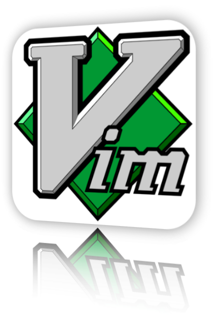

# Обработка текста

Кирилл Корняков (Itseez, ННГУ)  
Сентябрь 2013

<!--   01. Обработка текста / Текстовые редакторы
      - Редакторы: vim, Emacs, Sublime
      - Манипуляции (навигация, сортировка, сниппеты и макросы)
      - Regular expressions 
-->

# Содержание

  1. Текстовые редакторы
  2. Возможности современных тестовых редакторов (на примере Sublime)
  3. Regular expressions

# Два совета

> 1. Освойте слепой метод печати
     - Вы начинаете работать "со скоростью мысли"
     - Мозгу не нужно переключаться, вы фокусируетесь на задаче
     - Это полезно для глаз
     - Тренажеры: [русский](http://vse10.ru), [английский](http://www.ratatype.com)
  2. Избегайте использования мыши
     - Экономия до 30% рабочего времени
     - Освойте клавиатурные комбинации ("горячие клавиши")

# Текстовые редакторы

"Программист-прагматик":

> Используйте один текстовый редактор, но по максимуму.

**Полезные свойства:**

 - Кросс-платформенность
 - Настраиваемость
    - Шрифты, оформление, клавиатурные комбинации
 - Расширяемость
    - Новые языки программирования и форматы файлов
 - Программируемость
    - Программируемость сложных операций (макросы, сценарии)
 - Скорость

# Vim

+--------------------------------------+------------------------------------------------------------------------------+
|| - Vim - свободный текстовый редактор, созданный на базе vi.                  |
|                                      | - Один из мощнейших редакторов, с полной свободой настройки и автоматизации. |
|                                      | - Имеет огромное количество расширений (более 3000).                         |
|                                      | - Используется практически в любых проектах.                                 |
|                                      | - Один из культовых редакторов.                                              |
|                                      | - Официальный сайт проекта: <http://www.vim.org>.                            |
+--------------------------------------+------------------------------------------------------------------------------+

# Vim

# Vim

# Emacs

+-----------------------------------+----------------------------------------------------------------------------+
|| - Emacs - семейство расширяемых многофункциональных текстовых редакторов.  |
|                                   | - Возможно еще более мощный редактор, чем Vim (Emacs as OS).               |
|                                   | - Имеет более 2000 встроенных команд, позволяет комбинировать их в макросы.|
|                                   | - Второй культовый редактор.                                               |
|                                   | - Официальный сайт проекта <http://www.gnu.org/software/emacs/>.           |
+-----------------------------------+----------------------------------------------------------------------------+

# Emacs

# Идеология Emacs

  - «Всё в одном»
    - Функциональность: базовая, основной режим, дополнительные режимы
  - Расширяемость
    - Программируется на Elisp, имеются пакеты расширений, клавиатурные комбинации
  - Настраиваемость под пользователя
    - Elisp-переменные, определение функций, создание hook'ов
  - Документированность
    - Подробная документация, вплоть до функций и переменных

# Sublime

