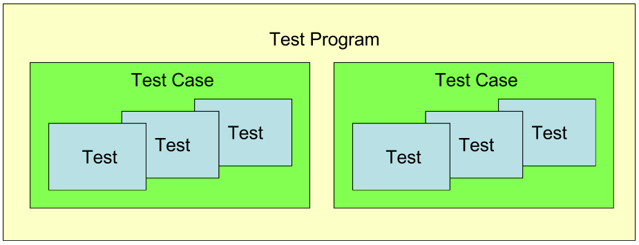

# Тестирование


Кирилл Корняков (Itseez, ННГУ)  
Октябрь 2013

<!-- TODO
  - Метафора, что тесты это кости
-->

# Содержание

  1. Введение в тестирование
  1. Фреймворки для Unit-тестирования
  1. Сервера непрерывной интеграции

# Виды тестирования

> 1. Ручное
     - Используется все меньше в самом процессе разработки
     - Чаще всего GUI и usability
     - Бета-тестирование с реальными пользователями
  1. Автоматизированное

# Классификация тестов: по масштабу

  - Модульные (Unit)
  - Инфраструктурные (Infrastructure)
  - Системные (System)

# Классификация тестов: по назначению

  - На задымление (Smoke)
  - Регрессионные (Regression)
  - Приемочные (Acceptance)
     - Функциональные (Functional)
  - На точность/совместимость (Conformance/Compliance/Accuracy)
  - На производительность (Performance)
     - Стресс (Stress)
     - Нагрузочные (Load)

# Классификация тестирования

Более детальная классификация может быть найдена на <http://ru.wikipedia.org/wiki/Тестирование_программного_обеспечения>.

Обычно выделяют следующие признаки:

 - По объекту тестирования
 - По знанию системы
 - По степени автоматизации
 - По степени изолированности компонентов
 - По времени проведения тестирования
 - По признаку позитивности сценариев
 - По степени подготовленности к тестированию

# Современная стратегия тестирования

  - Фокус на максимальную автоматизацию
    - Полное тестирование требуется несколько раз в день, каждому члену команды
  - Тесты пишутся самими разработчиками, часто еще до реализации
    - Тесты это лучшая документация, которая всегда актуальна (компилятор!)
    - Тесты это первые сэмплы, показывающие простые примеры использования
    - Test-Driven Development
  - Код тестируется **непрерывно**
    - Это делается локально на машине разработчика
    - Это делается на сервере до того, как добавить его в репозиторий
    - Только "зеленые" тесты могут дать уверенность в работоспособности кода

# Современная стратегия тестирования

  1. Автоматические тесты замещают отладку
     - Предсказуемость времени разработки
     - **Пойманный баг документируется в виде теста**
  1. Тесты - это "first-class citizens"
     - Стоит отдавать код только вместе с тестами
     - Нужно заботиться о качестве кода тестов
     - Метафора тестов: скелет

# Несколько примеров
 
  - Портирование ПО на новые платформы
  - Тестирование новых платформ

# Содержание

  1. Введение в тестирование
  1. <font color=red>Фреймворки для Unit-тестирования</font>
  1. Сервера непрерывной интеграции

# Фреймворки для Unit-тестирования

Пример тестов на Java c использованием JUnit

```
@Test
public void canAddNumbers()
{
    ComplexNumber z1 = new ComplexNumber(1, 2);
    ComplexNumber z2 = new ComplexNumber(3, 4);
    ComplexNumber sum = z1.add(z2);
    assertEquals(new ComplexNumber(4, 6), sum);
}

@Test
public void canMultiplyNumbers()
{
    ComplexNumber z1 = new ComplexNumber(1, 2);
    ComplexNumber z2 = new ComplexNumber(3, 4);
    ComplexNumber sum = z1.multiply(z2);
    assertEquals(new ComplexNumber(-5, 10), sum);
}
```

# Фреймворки для Unit-тестирования

  1. Значительно упрощают создание и запуск unit-тестов,  
     позволяют придерживаться единого стиля
  1. xUnit - часто используемое общее обозначение для подобных фреймворков
  1. Бесплатно доступны для большинства языков: JUnit, CUnit, CPPUnit, NUnit, GoogleTest

# Типичные возможности

  1. Удобное добавление тестов
    - Простая регистрация новых тестов
    - Набор функций-проверок (assert)
    - Общие инициализации и деинициализации
  1. Удобный запуск тестов
    - Пакетный режим
    - Возможность фильтрации тестов по именам
  1. Часто допускают интеграцию с IDE
  1. Генерация отчета в стандартном XML-формате
    - Возможность последующего автоматического анализа

# Google Test

  1. Популярный фреймворк для написания модульных тестов на С++, созданный Google
  1. [Open-source](http://code.google.com/p/googletest/) c лицензией BSD
     (допускает использование в закрытых коммерческих проектах)
  1. Используется в целом ряде крупных проектов
     - Chromium, LLVM компилятор, OpenCV
  1. Написан на C++, строится при помощи CMake
     - Поддерживает: Linux, Mac OS X, Windows, Cygwin, Windows CE, and Symbian
  1. Как правило используется в консольном режиме,  
     но существует вспомогательное GUI [приложение](http://code.google.com/p/gtest-gbar/)

# Возможности Google Test

  - Automatic test discovery
  - Rich set of assertions, user-defined assertions
  - Death tests
  - Fatal and non-fatal failures
  - Value- and type-parameterized tests
  - Various options for running the tests
  - XML test report generation

# Использование Google Test

  1. Скомпилировать Google Test в библиотеку.
  1. Создать новое консольное приложение (оболочку для тестов) и  
     прилинковать к нему библиотеку Google Test.
  1. Добавить тесты.
  1. Скомпилировать приложение с тестами и запустить его.

# Консольный лог Google Test

```
[mlong@n6-ws2 x86]$ bin/hellotest
Running main() from gtest_main.cc
[==========] Running 4 tests from 2 test cases.
[----------] Global test environment set-up.
[----------] 3 tests from VectorTest
[ RUN      ] VectorTest.testElementZeroIsOne
[       OK ] VectorTest.testElementZeroIsOne (0 ms)
[ RUN      ] VectorTest.testElementOneIsTwo
[       OK ] VectorTest.testElementOneIsTwo (0 ms)
[ RUN      ] VectorTest.testSizeIsTwo
[       OK ] VectorTest.testSizeIsTwo (0 ms)
[----------] 3 tests from VectorTest (0 ms total)

[----------] 1 test from MathTest
[ RUN      ] MathTest.Zero
[       OK ] MathTest.Zero (0 ms)
[----------] 1 test from MathTest (0 ms total)

[----------] Global test environment tear-down
[==========] 4 tests from 2 test cases ran. (0 ms total)
[  PASSED  ] 4 tests.
[mlong@n6-ws2 x86]$ 
```

# Базовые концепции



- Каждый тест реализован как функция, с использованием макроса `TEST()` или
`TEST_F()`.
- `TEST()` не только определяет, но и "регистрирует" тест.

# Пример 1

```
#include <gtest/gtest.h>
 
TEST(MathTest, TwoPlusTwoEqualsFour) {
  EXPECT_EQ(2 + 2, 4);
}
```

# Пример 2

Функция

```
int Factorial(int n); // Returns the factorial of n
```

Тесты

```
// Tests factorial of 0.
TEST(FactorialTest, HandlesZeroInput) {
  EXPECT_EQ(1, Factorial(0));
}

// Tests factorial of positive numbers.
TEST(FactorialTest, HandlesPositiveInput) {
  EXPECT_EQ(1, Factorial(1));
  EXPECT_EQ(2, Factorial(2));
  EXPECT_EQ(6, Factorial(3));
  EXPECT_EQ(40320, Factorial(8));
}
```

# Пример 3

```
#include <gtest/gtest.h>
#include <vector>
 
using namespace std;
 
// A new one of these is created for each test
class VectorTest : public testing::Test {
public:
  vector<int> m_vector;
 
  virtual void SetUp() {
    m_vector.push_back(1);
    m_vector.push_back(2);
  }
 
  virtual void TearDown() {}
};
 
TEST_F(VectorTest, testElementZeroIsOne) {
  EXPECT_EQ(m_vector[0], 1);
}
 
TEST_F(VectorTest, testElementOneIsTwo) {
  EXPECT_EQ(m_vector[1], 2);
}
 
TEST_F(VectorTest, testSizeIsTwo) {
  EXPECT_EQ(m_vector.size(), (unsigned int)2);
}
```

# Критерии хорошего теста

  1. AAA: Arrange, Act, Assert
  1. Сфокусированный (только один assert)
  1. Быстрый
  1. Независим от порядка исполнения и окружения

Ну и конечно же тест должен быть _автоматическим_ и иметь _чистый код_.

# Содержание

  1. Введение в тестирование
  1. Фреймворки для Unit-тестирования
  1. <font color=red>Сервера непрерывной интеграции</font>

# Непрерывная интеграция

> **Непрерывная интеграция (англ. Continuous Integration)** — это практика
> разработки ПО, которая заключается в выполнении частых автоматизированных
> сборок проекта для скорейшего выявления и решения интеграционных проблем.

Непрерывная сборка - это **сердцебиение** вашего проекта.

# Требования к проекту

  1. Исходный код и все, что необходимо для сборки и тестирования проекта,
     хранится в **централизованном репозитории**;
  1. Операции копирования из репозитория, сборки и тестирования всего проекта
     **автоматизированы**.

<center><center>

# Задачи выделенного сервера

  - Получение исходного кода из репозитория;
  - Сборка проекта;
  - Выполнение тестов;
  - Отправка отчетов;
  - Развёртывание готового проекта.

# Триггеры

  - На обновление состояния репозитория
  - Работа по расписанию (nightly testing)
  - Ручной запуск

# Примеры систем

  - Hudson > Jenkins
  - CruiseControl (CruiseControl.NET), TeamCity
  - Travis CI (аналог <https://drone.io>)
  - BuildBot

# Travis CI

+---------------------+------------------------------------------------------------+
|| - Веб-сервис для сборки и тестирования ПО                  |
|                     |   ([open-source](<https://github.com/travis-ci/travis-ci>))|
|                     | - Важными особенностями являются интеграция с GitHub       |
|                     |   и возможность бесплатного использования                  |
|                     | - Поддерживает большое количество языков: C, C++,          |
|                     |   Clojure, Erlang, Go, Groovy, Haskell, Java,              |
|                     |   JavaScript, Perl, PHP, Python, Ruby и Scala              |
|                     | - Тестирование происходит на виртуальных Linux-машинах,    |
|                     |   запускаемых в облаке Amazon (Amazon S3)                  |
|                     | - Официальный сайт проекта: <http://travis-ci.org>         |
+---------------------+------------------------------------------------------------+

# BuildBot

+------------------------+----------------------------------------------------------+
|| - Инструмент непрерывной интеграции                      |
|                        | - Используется в ряде крупных проектов: Chromium, WebKit,|
|                        |   Firefox, Python, OpenCV                                |
|                        | - Реализован на Python, как результат переносим и        |
|                        |   допускает кастомизацию (программирование билдеров)     |
|                        | - Проект разрабатывается на                              |
|                        |   [GitHub](<https://github.com/buildbot/buildbot>),      |
|                        |   тестируется при помощи                                 |
|                        |   [Travis CI](https://travis-ci.org/buildbot/buildbot/)  |
|                        | - Официальный сайт проекта: <http://buildbot.net>        |
+------------------------+----------------------------------------------------------+

# BuildBot

<center><center>

# Резюме

  1. Создание тестов - это составляющая самого процесса программирования. Только
     тесты могут дать уверенность в работоспособности кода.
  1. Весь продуктовый код должен быть покрыт автоматическими модульными тестами.
  1. Тесты должны прогоняться при каждом новом добавлении кода. Ежедневно
     должно проводиться полное тестирование проекта, желательно с публикацией
     тестовых дистрибутивов.

# Контрольные вопросы

  1. Основные возможности фреймворков модульного тестирования.
  1. Критерии хорошего теста.
  1. Непрерывная интеграция и требования к проекту.

# Ссылки

  1. <http://code.google.com/p/googletest/>
  1. [Google Test Talk](https://docs.google.com/presentation/d/1miS-qttABKfkIT9TG_HU6Kn3FrxZ9VNHD7nHIL4_3wE/present#slide=id.i81)
  1. 

# Спасибо!

Вопросы?