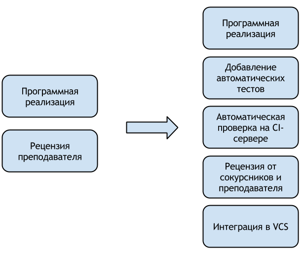

# Инструменты разработки

Кирилл Корняков (ННГУ, Itseez)\
Февраль 2016

<!-- TODO

  - Рядом с waterfall дать итеративную модель (Scrum)
  - Приоритетность API > тестов > реализации (нарисовать диаграмму)

-->

# Структура лекций

  1. Первые 10 минут письменная самостоятельная работа
     - Рекомендуется посещать и не опаздывать
  1. Основная часть, лекция
     - Рекомендуется вести конспект
  1. Иногда постараемся немного программировать

# Практические занятия

Необходимо разработать библиотеку на С++, которая:

  1. Решает простую прикладную задачу
  1. Собирается при помощи CMake
  1. Имеет модульные тесты на базе GoogleTest
  1. Имеет документацию
  1. Разрабатывается на GitHub

Каждый шаг засчитывается в момент попадания вашего кода в
[центральный репозиторий][upstream].

# Порядок приема лабораторных работ

# Отчетность

  - Наличие всех самостоятельных работ
  - Наличие кода в __центральном__ репозитории

Освобождений не планируется.

# Ресурсы

  - Репозиторий: __bit.ly/unn-devtools__
  - [Слайды][slides]

# Важность инструментов

Инструменты пока не могут создавать ПО вместо вас, однако

  - Значительно усиливают ваши способности
  - Работают пока вы спите

# Разнообразие технологий

Опыт типичного разработчика сегодня

  - __Host OS__: Windows, Linux, Mac OS X
  - __Target OS__: Embedded Win/Lin, Android, iOS
  - __Target HW__: x86, ARM, GPU, а также MIPS, DSP
  - __Языки__:
    - Native: С, С++, Objective-C
    - Bytecode: C#, Java
    - Dynamic: Python, Ruby
    - GPU: GLSL, CUDA, OpenCL
  - __IDE__: Borland Builder, MSVS, Eclipse, Qt Creator, Xcode

# Цели курса

> Познакомить с некоторыми __классами инструментов и подходами__,\
которые будут полезны при работе __в любом проекте и на любой платформе__.

# Хороший инструмент

Мы постараемся сосредоточиться на "хороших" инструментах.\
И очень часто это будут консольные и веб-приложения.

  1. Проверен временем
  1. Кросс-платформенный
  1. Допускает автоматизацию
  1. Быстрый
  1. Имеет открытый исходный код

# Программа курса: Жизненный цикл разработки ПО

__Waterfall Model__ of the Software Development Lifecycle

# Программа курса: От малого к большому

  1. Личное мастерство
     - Работа с текстом
     - Автоматизация
  2. Работа с кодом
     - Построение систем
     - Анализ бинарных модулей
  3. Качество кода
     - Содержание кода "в чистоте"
     - Тестирование и отладка
  4. Коллективная разработка
     - Коммуникация
     - Управление задачами
     - Формирование сообщества

# "Золотые" практики Программной Инженерии

  - Автоматические тесты
  - Непрерывная интеграция
  - Рецензии кода (формальные инспекции)
  - Использование VCS

\

При всей своей эффективности практики не находили широкого применения:

  - Ограниченная инструментальная поддержка (как следствие, накладность)
  - Непонятно как сочетать в рамках единого подхода

# Development Workflow

# Android Contribution Workflow

# OpenCV Workflow

# Инструментальная поддержка

  - Автоматические тесты
    - __Unit-testing frameworks__ (xUnit: JUnit, Google Test, NUnit)
  - Непрерывная интеграция (Continuous Integration)
    - __Continuous Integration systems__ (Jenkins, BuildBot, Travis)
  - Код ревью
    - Web-based __Code Review systems__ (Review Board, GitHub)
  - Использование VCS
    - __Distributed VCS__ (Git, Mercurial)

Сегодня все эти классы инструментов достаточно зрелые, и доступны бесплатно.

# Современное состояние

 - На сегодняшний день "лучшие" практики стали более легковесными,\
   и наконец сложились в некоторую "гармоничную" схему.
 - Эту схему можно условно назвать _современным рабочим процессом_ (workflow),\
   и она применяется во многих современных проектах (Android, Google, OpenCV).
 - Данный workflow имеет ряд преимуществ:
    - _простота и легковесность_
    - _стабильность_ — система всегда в рабочем состоянии
    - _высокое качество кода_ — благодаря объединению тестирования и рецензирования
    - _предсказуемость_ и _управляемость_ процесса разработки
\

Одним словом, появилась возможность контролируемо развивать ПО,\ снижая влияние
человеческого фактора.

# Базовые принципы

  1. Предпочитайте plain-text формат в качестве исходного
     - Храните исходники в VCS
     - Овладейте техникой обработки текста в совершенстве
  1. Освойте командную строку, используйте ее по максимуму
     - Обработка текста
     - Автоматизация рутинных операций
  1. Изучите Python и его популярные модули
     - NumPy, Matplotlib
     - XML, Excel, pdf, email

# Базовые принципы (2)

  1. В деталях изучите устройство бинарных модулей
     - Последовательность шагов построения приложений (компиляция и линковка)
     - Инструменты анализа готовых файлов
  1. Разрабатывайте так, чтобы вам не приходилось заниматься отладкой
     - Непрерывная интеграция (автоматическое тестирование)
     - Контроль качества кода (автоматический анализ и peer review)
  1. Переиспользуйте стороннее ПО, преимущественно open-source
     - Стремительное развитие проекта (Android)
     - Полная свобода настройки и переделки

# Книги

  - Стив Макконнелл "Совершенный код"
  - Дейв Томас, Энди Хант "Программист-прагматик"
  - Нил Форд "Продуктивный программист"
  - Kernighan & Pike "The Practice of Programming"

# Контрольные вопросы

  1. Общее назначение инструментов, примеры.
  1. Признаки "хороших" инструментов, с пояснениями.
  1. Примеры практик Программной инженерии, их суть.
  1. Приведите примеры инструментов, помогающих применять практики.
  1. Диаграмма каскадной модели жизненного цикла.
  1. Диаграмма работы программиста над задачей.

# Спасибо за внимание!

Вопросы?

<!-- LINKS -->

[slides]: http://unn-vmk-software.github.io/devtools-course-theory/
[upstream]: https://github.com/UNN-VMK-Software/devtools-course
