# Системы контроля версий


Кирилл Корняков (Itseez, ННГУ)\
3 Марта 2016

<!-- TODO
  - переделать таблицу, которая сейчас в html
  - Демо?
  - слить современное состояние и резюме
-->

# Содержание

  1. Системы контроля версий
  1. Git
  1. Модели рабочего процесса (командная работа)
  1. Заключение

# Тест Джоэла


Joel Spolsky, August 09, 2000

# Коллективная работа с кодом

  1. __История изменений__
     - Откат дефектных изменений
     - Извлечение кода "из прошлого" (как оно раньше работало?)
     - Поиск ошибок сравнением (кто это сделал?)
  1. __Централизованное хранение__
     - Актуальное и используемое всеми участниками (где последняя версия?!)
     - Защищенное, с разграничением прав доступа

\
__Машина времени__ и __сетевое хранилище__ в одном флаконе!\
Нужны ли специальные инструменты? Вспоминаем Sharepoint, tarballs.

# Системы контроля версий

> __Системы контроля версий__ — это программные системы, хранящие несколько
версий одного документа, и позволяющие вернуться к более ранним версиям. Как
правило, для каждого изменения запоминается дата модификации и автор.

# Патчи

> __Патч__ (англ. patch — заплатка) — информация, предназначенная для
автоматизированного внесения определённых изменений в компьютерные файлы.

__Unified diff format__: `@@ -l,s +l,s @@ optional section heading`

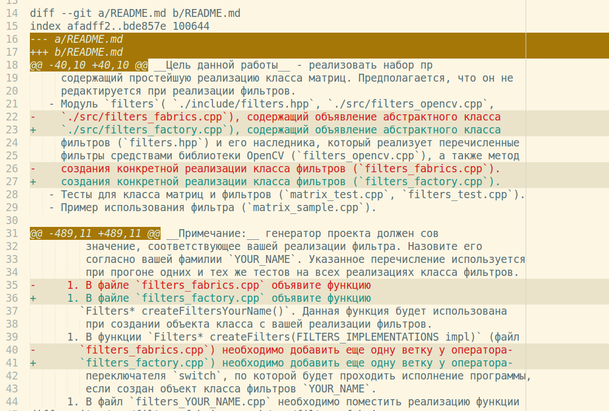

# Отображение на GitHub

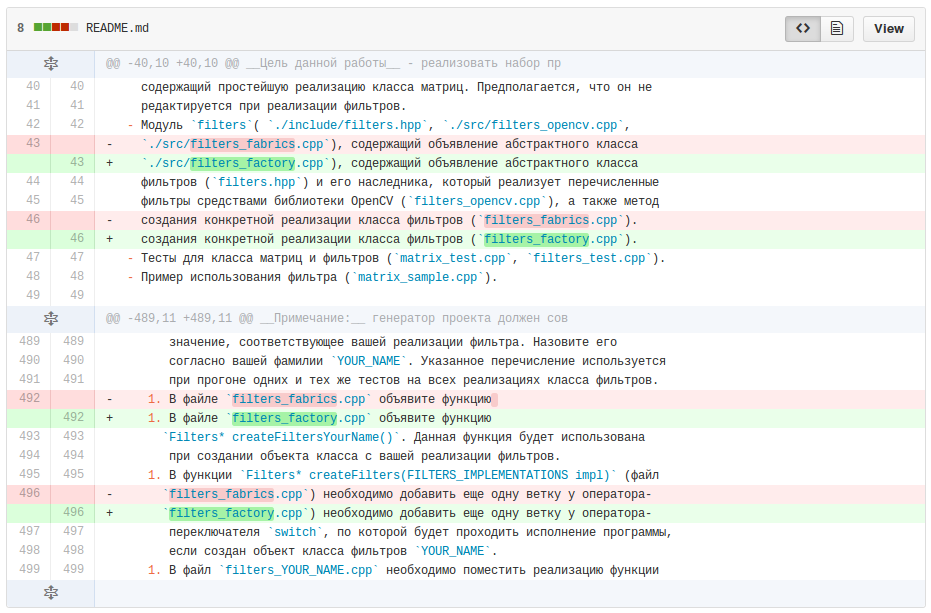

# Отображение в командной строке

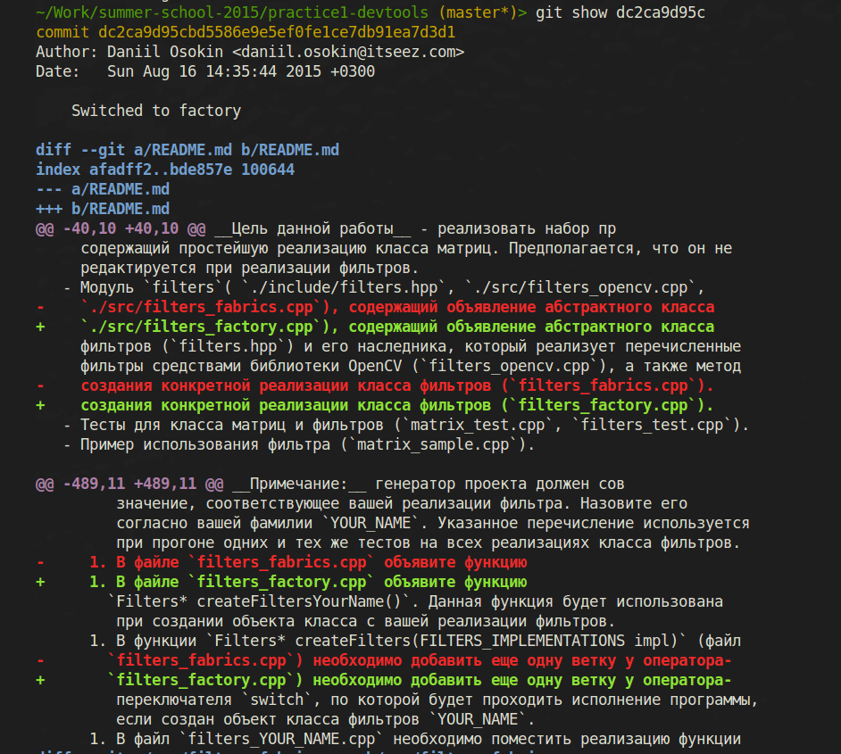

# Патчи

 - Патч — это простой текстовый файл, его можно наложить при помощи инструментов (`patch`).
 - Один патч может содержать изменения сразу нескольких файлов в разных директориях.
 - Люди могут обмениваться изменениями, посылая друг другу патчи.
 - Патч — это __атомарное изменение__ проекта!

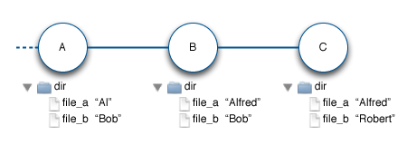

# Патчи и СКВ

 - СКВ — это своего рода БД патчей, ее называют __репозиторием__.
 - Патчи, помещенные в СКВ называются __commit__.
 - Последовательности __commit__ называются __changeset__.


# История изменений

+----------------------------------------------+--------------------------------+
| `ddc4a1d` — __Readme bug fixes.__            | 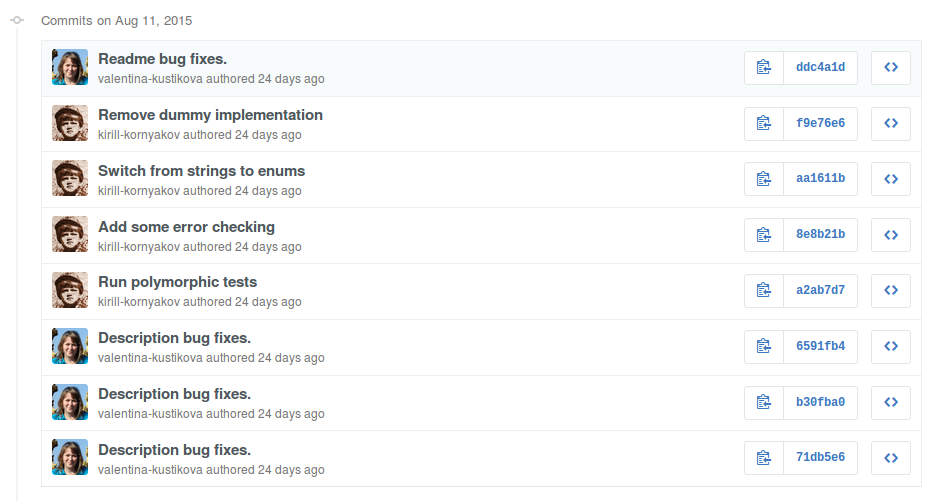|
| ```                                          |                                |
|  - README.md                                 | Последовательность патчей — это|
| ```                                          | полная история проекта.        |
| `f9e76e6` — __Remove dummy implementation__  |                                |
| ```                                          |                                |
|  - include/filters.hpp                       |                                |
|  - samples/matrix_sample.cpp                 |                                |
|  - src/filters_dummy.cpp                     |                                |
|  - src/filters_fabrics.cpp                   |                                |
|  - test/filters_test.cpp                     |                                |
| ```                                          |                                |
| `aa1611b` — __Switch from strings to enums__ |                                |
| ```                                          |                                |
|  - include/filters.hpp                       |                                |
|  - samples/matrix_sample.cpp                 |                                |
|  - src/filters_fabrics.cpp                   |                                |
|  - test/filters_test.cpp                     |                                |
| ```                                          |                                |
| `8e8b21b` — __Add some error checking__      |                                |
| ```                                          |                                |
|  - include/filters.hpp                       |                                |
|  - src/filters_fabrics.cpp                   |                                |
|  - test/filters_test.cpp                     |                                |
| ```                                          |                                |
+----------------------------------------------+--------------------------------+

# Визуализация истории изменений

<iframe width="1280" height="720" src="https://www.youtube.com/embed/ToD91PYaQOU" frameborder="0" allowfullscreen></iframe>

 - <http://www.youtube.com/watch?v=ToD91PYaQOU>
 - Сделано при помощи [gource](http://gource.io)

# Три поколения СКВ

+------------+-------------+--------------------+---------------------+-----------------------------------------------------+
| Generation | Networking  | Operations         | Concurrency         | Examples                                            |
+============+=============+====================+=====================+=====================================================+
| First      | None        | One file at a time | Locks               | RCS, SCCS                                           |
+------------+-------------+--------------------+---------------------+-----------------------------------------------------+
| Second     | Centralized | Multi-file         | Merge before commit | CVS, Subversion, SourceSafe, Team Foundation Server |
+------------+-------------+--------------------+---------------------+-----------------------------------------------------+
| Third      | Distributed | Changesets         | Commit before merge | Git, Mercurial, Bazaar                              |
+------------+-------------+--------------------+---------------------+-----------------------------------------------------+

Eric Sink ["A History of Version Control"](http://www.ericsink.com/vcbe/html/history_of_version_control.html)

# Три поколения СКВ: Локальные

<center></center>

  - Примеры: RCS, SCCS
  - Организация одновременной работы: locks

# Три поколения СКВ: Централизованные

<center></center>

  - Примеры: Subversion, CVS
  - Организация одновременной работы: merge before commit

# Три поколения СКВ: Распределенные

<center></center>

  - Примеры: Git, Mercurial
  - Организация одновременной работы: commit before merge

# Преимущества распределенных СКВ (DVCS)

  1. Допускают локальную работу (коммиты без наличия интернет)
  1. Упрощают слияние (а значит параллельную разработку)
  1. Дают максимальную свободу по организации рабочего процесса (workflow)

Благодаря этому, они фактически стали стандартом де-факто.

# Популярные СКВ

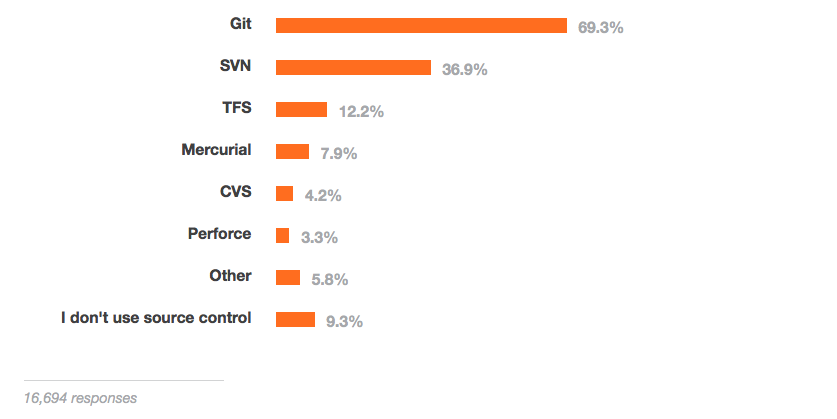

[Stack Overflow Developer Survey 2015](http://stackoverflow.com/research/developer-survey-2015)

# Компании и проекты, использующие Git

<!-- Image credit: http://git-scm.com/ -->
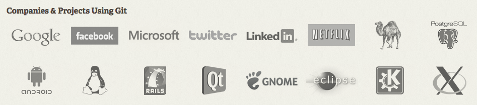

<!-- TOC -->

# Git

+-----------------------+-------------------------------------------------------------------------+
|| - Разработан Линусом Торвальдсом для работы над ядром Linux в 2005 году.|
|                       | - В настоящее время поддерживается Джунио Хамано, сотрудником Google.   |
|                       | - Не очень прост в освоении, однако очень быстрый и функциональный.     |
|                       | - Имеет наиболее "сильное" сообщество, инструментальную поддержку.      |
|                       | - Огромное количество информации в интернет: инструкции, уроки, статьи  |
|                       | - Официальный сайт проекта: <http://www.git-scm.org>.                   |
+-----------------------+-------------------------------------------------------------------------+

# Pro Git

+----------------------+-----------------------------------------------------------------------------+
|| - Лучшая книга про Git                                                      |
|                      | - Доступна бесплатно                                                        |
|                      | - Переведена на [русский язык](https://git-scm.com/book/ru/v1)              |
|                      | - Единственный способ по-настоящему понять Git — это узнать как он работает |
|                      | - __Нужно прочесть хотя бы первые 100 страниц__                             |
+----------------------+-----------------------------------------------------------------------------+

Как сказал Евклид египетскому царю Птолемею:

> «Царской дороги в геометрии нет!»

# Atlassian SourceTree

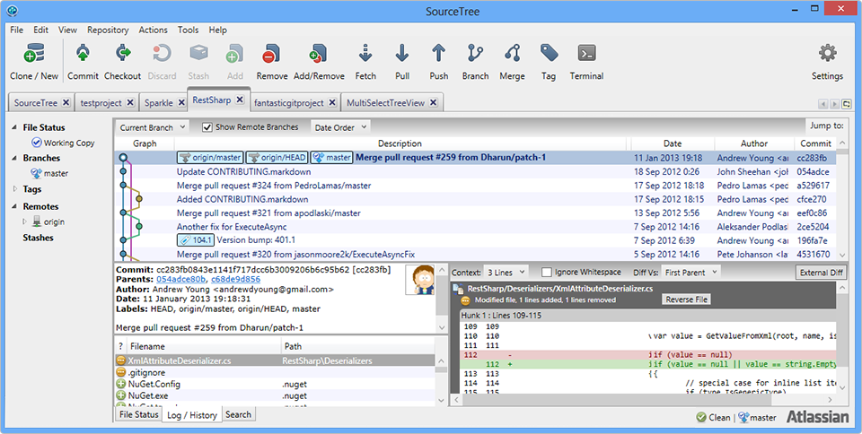

# Tortoise Git

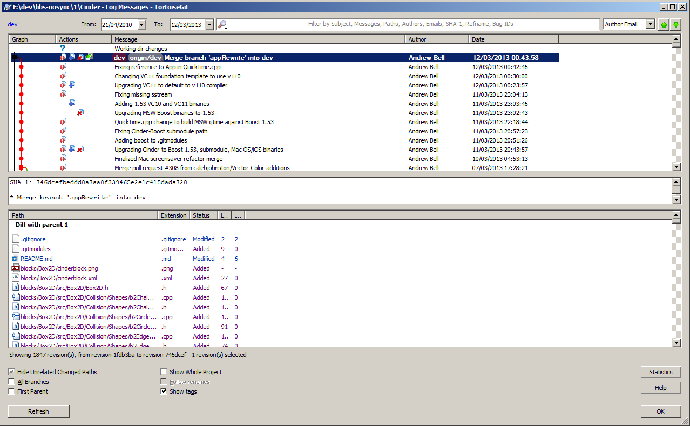

# GitHub Desktop


# Command Line Interface!

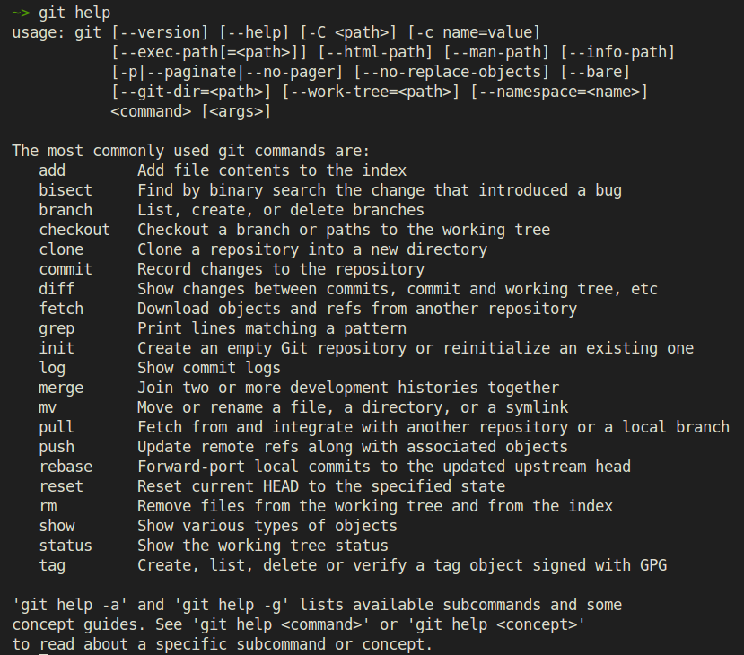

# Git objects

<center></center>

  - По сути это _внутреннее_ представление патча
  - Пользователю приходится работать только с коммитами (слава богу!)

Показать содержимое коммита:

```txt
$ git show --raw dc2ca9d95c

commit dc2ca9d95cbd5586e9e5ef0fe1ce7db91ea7d3d1
Author: Daniil Osokin <daniil.osokin@itseez.com>
Date:   Sun Aug 16 14:35:44 2015 +0300

    Switched to factory

:100644 100644 afadff2... bde857e... M  README.md
:100644 000000 c977bf3... 0000000... D  src/filters_fabrics.cpp
:000000 100644 0000000... c977bf3... A  src/filters_factory.cpp
```

# Git commits

<center></center>

Вывести историю изменений:

```txt
$ git log

commit aaa321be9191da60ad52c2bc41bd749ed546b409
Merge: 98fce98 3c1d15a
Author: Valentina <valentina-kustikova@users.noreply.github.com>
Date:   Thu Aug 13 10:14:47 2015 +0300

    Merge pull request #11 from valentina-kustikova/master

    Practice description (bug fixes).

commit 3c1d15a1bf366864593f2320fa9a0e6cf3586f52
Author: valentina-kustikova <valentina.kustikova@gmail.com>
Date:   Thu Aug 13 10:08:59 2015 +0300

    Practice description (bug fixes).
```

# Понятие ветки (branch)

  - Ветка в Git'е — это просто __указатель__ на один из коммитов.
  - Есть соглашение, что имя __`master`__ используется для ветки,\
    указывающей на последнее актуальное состояние проекта.

<center></center>

Вывести список существующих веток:

```txt
$ git branch
* master
```

# Git `branch`

Создать новую ветку с именем `testing` (указатель на коммит!):

```txt
$ git branch testing
```
<center></center>

Текущий список веток:

```txt
$ git branch
* master
  testing
```

# HEAD

  - `HEAD` — специальный указатель, ссылающийся на локальную ветку, на которой
    вы находитесь.
  - Это просто алиас (псевдоним) для текущей ветки, введенный для удобства.

<center></center>

# Git `checkout`

Извлечь состояние репозитория, соответствующее ветке `testing`:

```txt
$ git checkout testing
```
<center></center>

Вывести список существующих веток:

```txt
$ git branch
  master
* testing
```

# Три состояния файлов

<center></center>

# Git `commit`

```bash
$ vim README.md
$ git add README.md
$ git commit -m 'Made a change'
```
<center></center>

# Go back to `master`

```bash
$ git checkout master
```
<center></center>

# Make a commit to `master`

```bash
$ vim main.cpp

$ git add main.cpp
$ git commit -m 'Made other changes'

# Или можно сделать так
$ git status
$ git commit -a -m 'Made other changes'
```
<center></center>

# Merging

<center></center>

# Merging

<center></center>

  - `С6` — это так называемый _merge commit_
  - Он основан не на каком-то патче, он указывает на состояние проекта,\
    в котором наложены патчи обоих ветвей (`master` и `testing`).

# Merge Conflicts

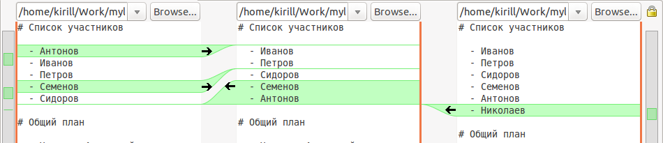

  - Возникают когда несколько участников отредактировали одинаковые строки,\
    или когда это произошло в разных ветках.
  - Разрешаются человеком при помощи инструментов (`git mergetool`).
  - В реальности довольно редкая ситуация, если соблюдать практики:
    - Грамотное распределение задач
    - Частые коммиты, много маленьких веток, частая интеграция

# Multiple Branches

<center></center>

  - Даже у одного разработчика может быть несколько активных веток.
  - Правильно создавать отдельную ветку на каждую логически независимую задачу.
  - Долгоживущие ветки — это неправильно, они быстро устаревают.

# Современное состояние

  - Использование в ИТ-проектах:
    - Фундаментальный инструмент разработки
    - Также используется для: файлы конфигурации, документация, тестовые данные
      и пр.
  - Нестандартные применения Git
    1. Хранилище для веб-контента: [GitHub pages](http://pages.github.com),
       devtools [page][devtools-html].
    1. Легковесная база данных. 
    1. Git можно использовать программно при помощи
       [libgit2](https://github.com/libgit2/libgit2), практически из любого
       популярного языка.

# Резюме

  1. Системы контроля версий — центральный инструмент разработки
     - Навигация по истории изменений
     - Централизованный доступ
  1. Имеются и другие применения:
     - Конфигурации, документация, компьютерная анимация, САПР и др.
     - Появляется все больше примеров использования в других отраслях
       ([книгоиздание](https://github.com/certik/theoretical-physics),
       [государственные документы](http://www.youtube.com/watch?v=CEN4XNth61o)).
  1. Распределенные СКВ фактически стали стандартом. Их сильные стороны:
     - Допускают локальные коммиты (без наличия интернет или доступа к серверу)
     - Упрощают слияние (а значит параллельную разработку)
     - Дают максимальную свободу по организации рабочего процесса (workflow)
  1. Git не самая простая в освоении СКВ, однако очень функциональная,\
     к тому же дает максимальную свободу по организации процесса разработки.

# Контрольные вопросы

  1. Определение СКВ
  1. Основные функции/возможности современных СКВ
  1. Преимущества DVCS

# Ссылки

  1. Wikipedia ["Системы контроля версий"][wiki-vcs].
  1. [Pro Git][git] by Scott Chacon.
  1. ["Mercurial tutorial"](http://hginit.com) by Joel Spolsky.

# Спасибо!

Вопросы?

<!-- LINKS -->

[wiki-vcs]: http://ru.wikipedia.org/wiki/%D0%A1%D0%B8%D1%81%D1%82%D0%B5%D0%BC%D0%B0_%D1%83%D0%BF%D1%80%D0%B0%D0%B2%D0%BB%D0%B5%D0%BD%D0%B8%D1%8F_%D0%B2%D0%B5%D1%80%D1%81%D0%B8%D1%8F%D0%BC%D0%B8#.D0.91.D0.B0.D0.B7.D0.BE.D0.B2.D1.8B.D0.B5_.D0.BF.D1.80.D0.B8.D0.BD.D1.86.D0.B8.D0.BF.D1.8B_.D1.80.D0.B0.D0.B7.D1.80.D0.B0.D0.B1.D0.BE.D1.82.D0.BA.D0.B8_.D0.9F.D0.9E_.D0.B2_VCS
[git]: http://git-scm.com
[devtools-html]: http://unn-vmk-software.github.io/devtools-course-theory

<!-- BACKUP

# Основные термины

+----------------------------+---------------------------+
| - repository               | - pull/merge request      |
| - working copy             | - merge, integration      |
| - revision                 | - conflict                |
| - head                     | - rebase                  |
| - check-out, clone         | - shelving, stashing      |
| - update, sync             | - branch                  |
| - check-in, commit, submit | - trunk, mainline, master |
| - commit, changeset, patch | - tag, label              |
+----------------------------+---------------------------+

[Глоссарий](http://ru.wikipedia.org/wiki/%D0%A1%D0%B8%D1%81%D1%82%D0%B5%D0%BC%D0%B0_%D1%83%D0%BF%D1%80%D0%B0%D0%B2%D0%BB%D0%B5%D0%BD%D0%B8%D1%8F_%D0%B2%D0%B5%D1%80%D1%81%D0%B8%D1%8F%D0%BC%D0%B8#.D0.A1.D0.BB.D0.BE.D0.B2.D0.B0.D1.80.D1.8C)

-->
