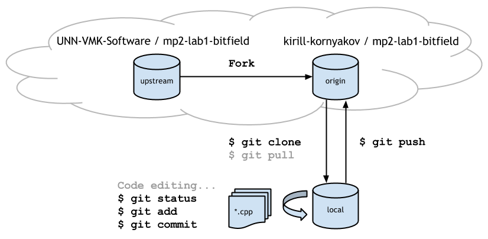
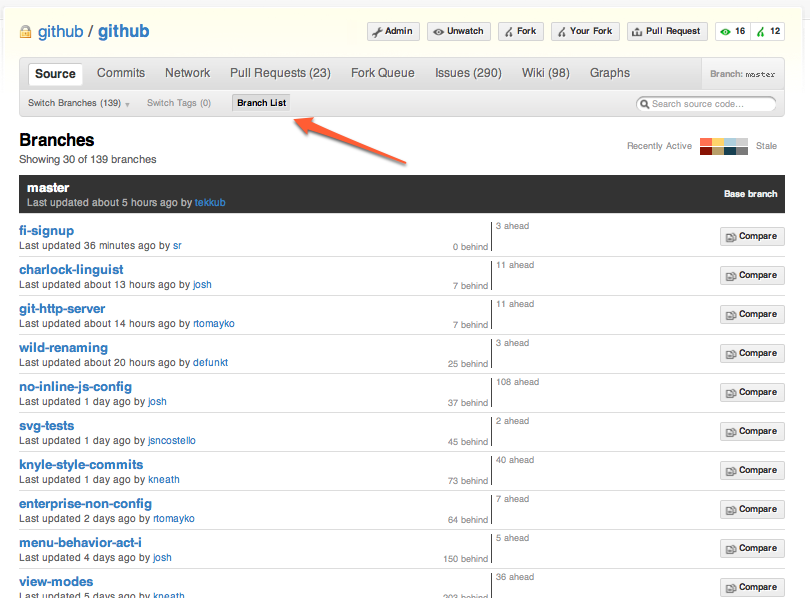
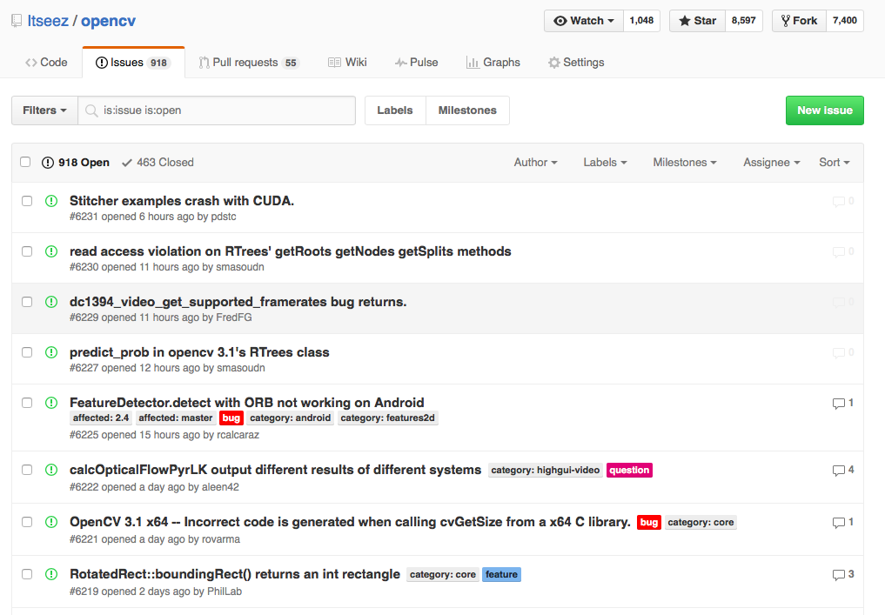
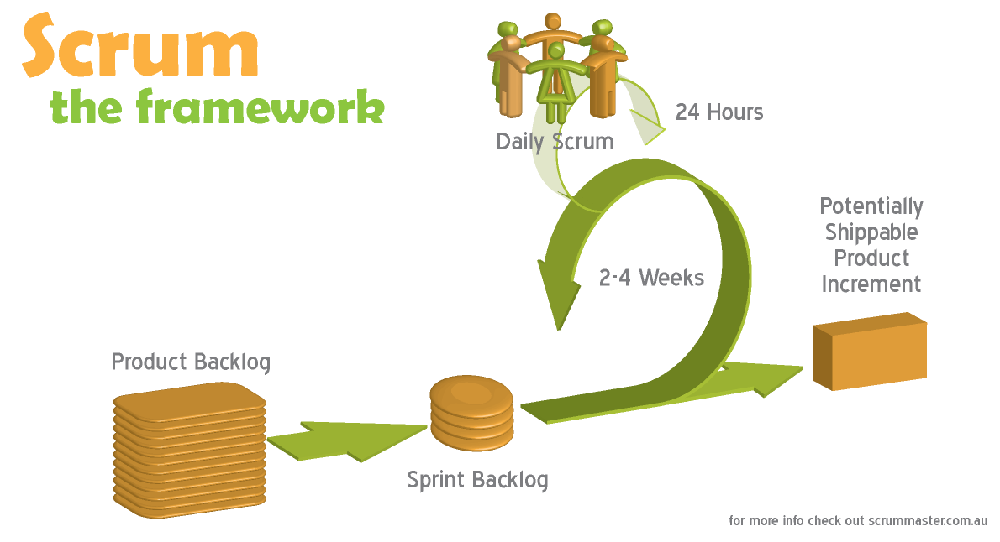
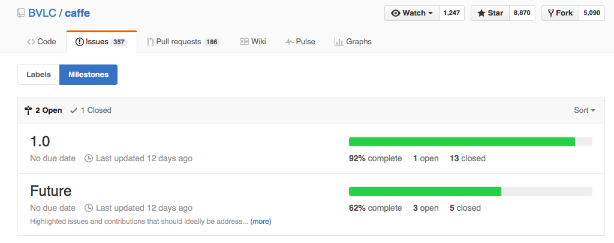
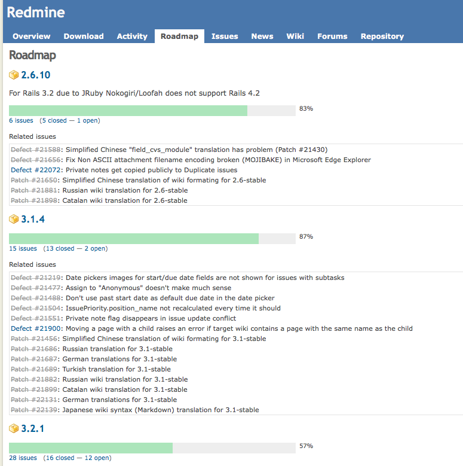

# Коллективная разработка


Кирилл Корняков (Itseez, ННГУ)

<!-- TODO
  - переделать эту лекцию в vcs-teamwork, убрать материал про задачи
  - В реальности можно посветить всю лекцию моделям рабочего процесса
    и моделям ветвления (подготовка релиза). Учет задач можно вынести.
  - Нужно изображение про подготовку релизов (частично есть в GitFlow)
  - Вставить заглавную картинку
  - Демо?
-->

# Содержание

  1. Модели распределенного рабочего процесса
  1. Модели ветвления
  1. Учет задач и планирование (issue tracking)

# Тест Джоэла


Joel Spolsky, August 09, 2000

<!-- TOC -->

# Распределенная работа

+-------------------------------+-----------------------------------------------+
| |  1. Распределенные рабочие процессы (workflow)|
|                               |     - Centralized                             |
|                               |     - Integration Manager                     |
|                               |     - Dictator and Lieutenants                |
|                               |  1. Модели ветвления (branching model)        |
|                               |     - GitFlow                                 |
|                               |     - GitHub Flow                             |
+-------------------------------+-----------------------------------------------+

# Centralized Workflow

<center>  </center>

Плюсы и минусы данного подхода?

# Integration Manager Workflow

<center>  </center>

Плюсы и минусы данного подхода?

# Dictator and Lieutenants Workflow

<center>  </center>

<!-- TOC -->

# Git Flow

<center>  </center>

A successful Git branching model ([link][gitflow])

# Triangular Workflow (GitHub)

<center>  </center>

```bash
$ cd mp2-lab1-bitfield
$ git remote -v
origin  https://github.com/kirill-kornyakov/mp2-lab1-bitfield.git (fetch)
origin  https://github.com/kirill-kornyakov/mp2-lab1-bitfield.git (push)
upstream  https://github.com/UNN-VMK-Software/mp2-lab1-bitfield.git (fetch)
upstream  https://github.com/UNN-VMK-Software/mp2-lab1-bitfield.git (push)
```

# GitHub Flow

<center>  </center>

[GitHub Flow][github-flow]

# GitHub Flow

Anything in the `master` branch is deployable.

  1. Create branch
     - To work on something new, create a descriptively named branch off of
       `master` (ie: `new-oauth2-scopes`).
  1. Develop in branch
     - Commit to that branch locally and regularly push your work to the same
       named branch on the server.
  1. Open a pull request (ask for review)
     - When you need feedback or help, or you think the branch is ready for
       merging, open a pull request.
  1. Merge after review
     - After someone else has reviewed and signed off on the feature, you can
       merge it into `master`.
  1. Deploy
     - Once it is merged and pushed to `master`, you can and _should_ deploy
       immediately.

# GitHub Flow в командах Git

```bash
# Check that origin and upstream repositories are correctly defined
$ git remote -v

# Get the latest sources from the upstream repository
$ git remote update

# Checkout a new topic branch for development
$ git checkout -b adding-new-feature upstream/master

#
# Do some development...
#

# Check your changes
$ git status

# Commit your changes
$ git commit -a -m "Added a new feature"

# Push your changes to the origin
$ git push origin HEAD
```

# Базовые принципы

  1. Каждому проекту следует выработать свой рабочий процесс и правила
     именования веток. При этом желательно основываться на популярных подходах.
  1. Приложение строится только на на основе известного состояния репозитория:
     - Не только релизы, но и экспериментальные и тестовые сборки (builds).
     - В идеале приложение умеет сообщать свою ревизию и параметры сборки.
  1. Стабильность общих (публичных) веток:
     - Они обязаны компилироваться и проходить все тесты в любой момент времени.
     - Изменения тестируются до попадания в репозиторий.
     - Если дефектные изменения прошли, они исправляются в срочном порядке.
  1. Абсолютно вся разработка фиксируется в истории:
     - Это делается в виде отдельных веток локального или глобального репозитория.
     - "Удачные" изменения добавляются в основную ветвь.
  1. Публичная история проекта не "переписывается":
     - Однажды помеченные тэгами и выпущенные релизы модификации не подлежат.
     - Промежуточная история не переписывается, потому что будут конфликты.

<!-- TOC -->

# GitHub Issues



# Учет и планирование задач



# GitHub Milestones



# Redmine Roadmap



# Простые истины

  - Законченных приложений не бывает, бывают только "мертвые"
  - Приложений без ошибок не существует, вопрос в их количестве и критичности
  - Пожеланий (feature request) всегда будет слишком много
  - Времени никогда не хватает, вопрос в эффективном его использовании
  - Про задачи полезно думать как про молекулы "жидкости" (вспоминаем коммиты)
  - Про приложение полезно думать не про что-то жесткое, а как про растущий
    организм, постоянно изменяющий свой облик
  - Выигрывает тот, кто сумеет организовать постоянную и быструю эволюцию своего
    приложения (адаптация к изменяющимся условиям)

# Практические рекомендации

  - Задачи можно делить на две простые категории:
    - Дефекты (bugs)
    - Новые функциональные возможности (features)
    - Иногда можно добавить еще просто задачи (tasks)
  - Дефекты
    - Дефекты (bugs) нужно делить на критические и некритические.
    - В наличии некритических нет ничего критического.
    - Критических ошибок быть не должно вообще! Их исправляем в первую очередь.
  - Новые возможности
    - Функции стоит реализовывать в порядке приоритета.
    - Редко когда имеет смысл откладывать релиз из-за того, что не все новые
      функции добавлены.

# Контрольные вопросы

  1. Centralized Workflow (диаграмма, достоинства и недостатки)
  1. Integration Manager Workflow (диаграмма, достоинства и недостатки)
  1. Dictator and Lieutenants Workflow (диаграмма, достоинства и недостатки)
  1. Модель ветвления GitFlow
  1. Рабочий процесс (модель ветвления), используемый в компании GitHub
  1. Базовые принципы корректной работы с СКВ
  1. Простые истины планирования
  1. Практические рекомендации при учете задач (issue tracking)

# Спасибо!

Вопросы?

<!-- LINKS -->

[github-flow]: http://scottchacon.com/2011/08/31/github-flow.html
[gitflow]: http://nvie.com/posts/a-successful-git-branching-model
