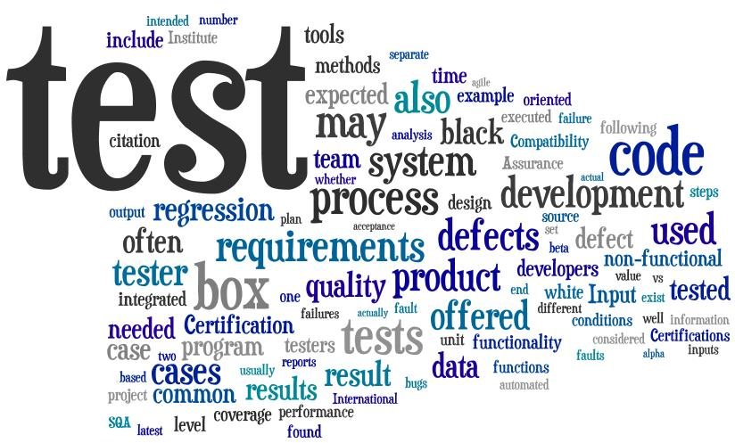
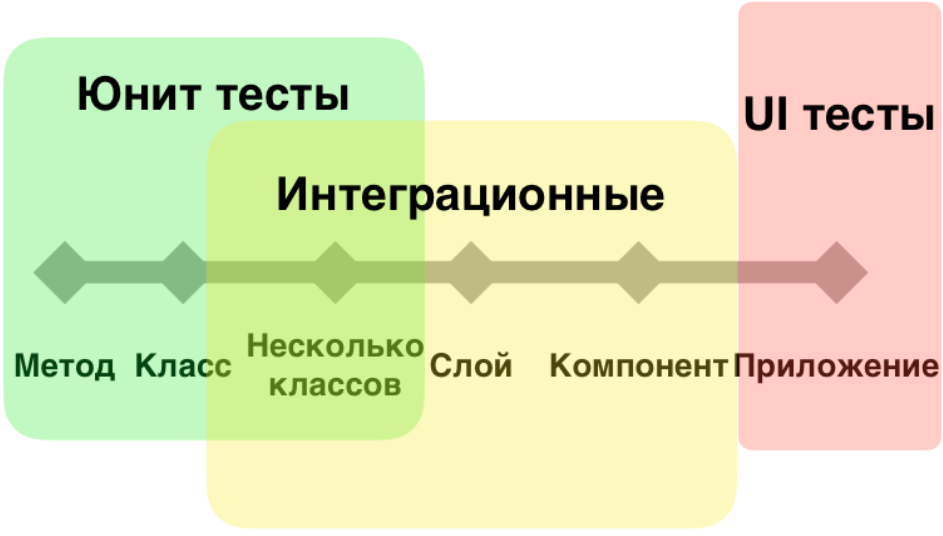
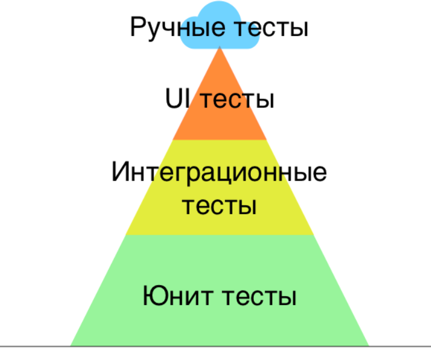
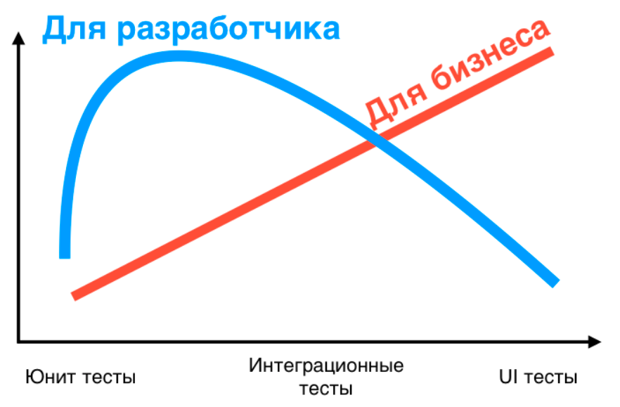
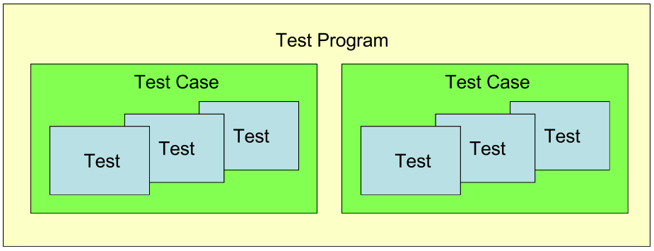
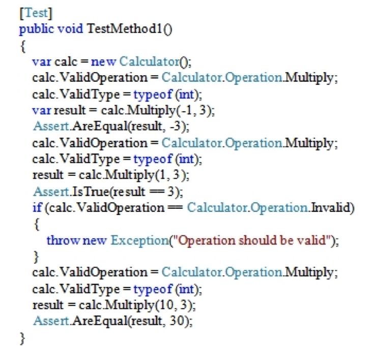
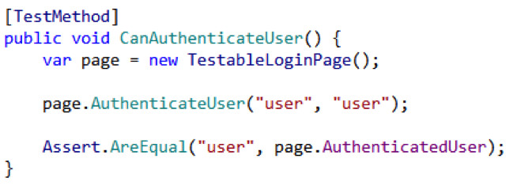

# Модульное тестирование



Кирилл Корняков, Intel\
Антон Бевзюк, Додо Пицца\
Ноябрь 2017

<!-- TODO
  - Стоит показать пример юнит-теста в самом начале
  - Стоит показать примеры юнит-тестов на разных языках
  - Нужно рассмотреть наивную реализацию юнит-тестов,
    когда функции руками добавляются в main

"Regression testing"? What's that? If it compiles, it is good; if it boots up, it is perfect.

    Torvalds, Linus (1998-04-08). Message. linux-kernel mailing list. IU. Retrieved on 2006-08-28.
-->

# Содержание

  1. Введение в тестирование
  1. Фреймворки для Unit-тестирования
  1. Google Test

# Ручное тестирование

  - Ключевые термины
    - __Тест__ — проверка, осуществляемая "руками"
    - __Тест-план__ — документ со списком проверок
    - Отдел тестирования (QA)
  - Профессия ручного тестировщика вырождается!
    - _За качество ответственность несут разработчики_ (пишут тесты!)
    - Software Engineer in Test (Google), DevOps, QA Automation Engineer
  - Ручное тестирование используется для:
     - Тестирования GUI и UX (удобства использования)
     - Бета-тестирование с реальными пользователями

# Автоматические тесты

  - __Тест__ — это "обычная" функция, реализующая некоторый сценарий
    использования программных сущностей.
  - __Тестовая сборка (test suite)__ — приложение с тестами, обычно консольное.

```cpp
#include <gtest/gtest.h>

TEST(TBitField, can_set_bit)
{
    // Arrange
    TBitField bf(10);

    // Act
    bf.SetBit(3);

    // Assert
    EXPECT_NE(0, bf.GetBit(3));
}
```

# Пример тестов на Java c использованием JUnit

```java
@Test
public void canAddNumbers()
{
    // Arrange
    ComplexNumber z1 = new ComplexNumber(1, 2);
    ComplexNumber z2 = new ComplexNumber(3, 4);

    // Act
    ComplexNumber sum = z1.add(z2);

    // Assert
    assertEquals(new ComplexNumber(4, 6), sum);
}

@Test
public void canMultiplyNumbers()
{
    // Arrange
    ComplexNumber z1 = new ComplexNumber(1, 2);
    ComplexNumber z2 = new ComplexNumber(3, 4);

    // Act
    ComplexNumber mult = z1.multiply(z2);

    // Assert
    assertEquals(new ComplexNumber(-5, 10), mult);
}
```

# Классификация тестов: по масштабу



# Пирамида тестов



# Ценность тестов



# Классификация тестов: по назначению

  - Функциональные требования
    - На задымление (smoke)
    - Регрессионные (regression)
    - На точность (accuracy)
    - Соответствие/совместимость (conformance/compliance)
    - Приемочные (acceptance)
    - Функциональные (functional)
  - Нефункциональные требования
    - На производительность (performance)
    - Стресс (stress)
    - Нагрузочные (load)
    - Качество кода (code quality)

# Необходимость автоматических тестов

  - Контролируемое развитие системы, расширение функционала
  - Коллективное владение
  - Работа с legacy-кодом (сторонние контрибуции)
  - Портирование ПО на новые платформы
  - Тестирование новых платформ

__Код модифицируется счетное число раз, а тестируется десятки тысяч раз!__

# Расстановка приоритетов

  1. API (h-файлы)
     - Единственное, что по-настоящему интересует ваших пользователей
     - GoF: __Program to an interface, not an implementation.__
  1. Unit-tests (cpp-файлы с тестами)
     - Автоматический контроль корректности, на века!
     - __Лучшая документация!__
  1. Implementation (cpp-файлы)
     - По большому счету это ваше личное дело, как выглядит реализация\
       при условии что интерфейс простой и понятный, а тесты полны
     - Главные достоинства реализации: простота и корректность

<!-- TOC -->

# Содержание

  1. Введение в тестирование
  1. <font color=red>Фреймворки для Unit-тестирования</font>
  1. Google Test

# Фреймворки для Unit-тестирования

Значительно упрощают создание и запуск unit-тестов,\
позволяют придерживаться единого стиля.

  1. xUnit — общее обозначение для подобных фреймворков.
  1. Бесплатно доступны для большинства языков:
     - C/C++: CUnit, CPPUnit, GoogleTest
     - Java: JUnit
     - .NET: NUnit
  1. __Встроены в современные языки:__
     - D, Python, Go

# Типичные возможности

  1. Удобное добавление тестов
    - Простая регистрация новых тестов
    - Набор функций-проверок (`assert`)
    - Общие инициализации и деинициализации
  1. Удобный запуск тестов
    - Пакетный режим
    - Возможность фильтрации тестов по именам
  1. Часто допускают интеграцию с IDE
  1. Генерация отчета в стандартном XML-формате
    - Возможность последующего автоматического анализа
    - Публикация на web-страницах проекта

<!-- TOC -->

#


# Google Test

  1. Популярный фреймворк для написания модульных тестов на С++,\
     разработанный Google.
  1. [Open-source][gtest] проект c BSD-лицензией\
     (допускает использование в закрытых коммерческих проектах).
  1. Используется в целом ряде крупных проектов
     - Chromium, LLVM компилятор, OpenCV
  1. Написан на C++, строится при помощи CMake
     - Поддерживает: Linux, Mac OS X, Windows, Cygwin, Windows CE и Symbian
  1. Как правило используется в консольном режиме,
     но существует вспомогательное GUI [приложение](gtest_bar).

# Возможности Google Test

  - Automatic test discovery
  - Rich set of assertions, user-defined assertions
  - Death tests
  - Fatal and non-fatal failures
  - Value- and type-parameterized tests
  - Various options for running the tests
  - XML test report generation

# Базовые концепции



  - Каждый тест реализован как функция, с использованием макроса `TEST()` или
    `TEST_F()`.
  - `TEST()` не только определяет, но и "регистрирует" тест.

# Пример 1

```cpp
#include <gtest/gtest.h>

TEST(MathTest, TwoPlusTwoEqualsFour) {
  EXPECT_EQ(2 + 2, 4);
}
```

# Пример 2

Функция

```cpp
int Factorial(int n); // Returns the factorial of n
```

Тесты

```cpp
// Tests factorial of 0.
TEST(FactorialTest, HandlesZeroInput) {
  EXPECT_EQ(1, Factorial(0));
}

// Tests factorial of positive numbers.
TEST(FactorialTest, HandlesPositiveInput) {
  EXPECT_EQ(1, Factorial(1));
  EXPECT_EQ(2, Factorial(2));
  EXPECT_EQ(6, Factorial(3));
  EXPECT_EQ(40320, Factorial(8));
}
```

# Пример 3

```cpp
#include <gtest/gtest.h>
#include <vector>

using namespace std;

// A new one of these is created for each test
class VectorTest : public testing::Test {
public:
  vector<int> m_vector;

  virtual void SetUp() {
    m_vector.push_back(1);
    m_vector.push_back(2);
  }

  virtual void TearDown() {}
};

TEST_F(VectorTest, testElementZeroIsOne) {
  EXPECT_EQ(m_vector[0], 1);
}

TEST_F(VectorTest, testElementOneIsTwo) {
  EXPECT_EQ(m_vector[1], 2);
}

TEST_F(VectorTest, testSizeIsTwo) {
  EXPECT_EQ(m_vector.size(), (unsigned int)2);
}
```

# Консольный лог Google Test

```txt
[mlong@n6-ws2 x86]$ bin/hellotest
Running main() from gtest_main.cc
[==========] Running 4 tests from 2 test cases.
[----------] Global test environment set-up.
[----------] 3 tests from VectorTest
[ RUN      ] VectorTest.testElementZeroIsOne
[       OK ] VectorTest.testElementZeroIsOne (0 ms)
[ RUN      ] VectorTest.testElementOneIsTwo
[       OK ] VectorTest.testElementOneIsTwo (0 ms)
[ RUN      ] VectorTest.testSizeIsTwo
[       OK ] VectorTest.testSizeIsTwo (0 ms)
[----------] 3 tests from VectorTest (0 ms total)

[----------] 1 test from MathTest
[ RUN      ] MathTest.Zero
[       OK ] MathTest.Zero (0 ms)
[----------] 1 test from MathTest (0 ms total)

[----------] Global test environment tear-down
[==========] 4 tests from 2 test cases ran. (0 ms total)
[  PASSED  ] 4 tests.
```

# Полезные советы

Тесты можно временно выключать

```cpp
TEST(MathTest, DISABLED_two_plus_two_equals_four)
{
  int x = 2 + 2;

  EXPECT_EQ(4, x);
}
```

Тесты можно фильтровать по имени при запуске

```bash
$ ./bin/hellotest --gtest_filter=*Vector*
```

У Google Test есть ряд других полезных опций

```bash
$ ./bin/hellotest --help
```

<!-- TOC -->

#

+-------------------------+---------------------------------+
|__Юнит-тест курильщика__ |__Юнит-тест здорового человека__ |
+-------------------------+---------------------------------+
|  |         |
+-------------------------+---------------------------------+

Авторство: Антон Бевзюк, SmartStepGroup.

# Критерии хорошего теста

  1. Короткий (имеет чистый код)
  1. Сфокусированный (только один assert)
  1. Быстрый
  1. Автоматический
  1. Независим от порядка исполнения и окружения

Паттерн AAA: Arrange, Act, Assert

# Современная стратегия тестирования

  - Без "зеленых" тестов нет уверенности в работоспособности кода
  - Фокус на максимальную автоматизацию
    - Полное тестирование требуется несколько раз в день, каждому члену команды
  - __Тесты пишутся самими разработчиками, одновременно с реализацией__
    - Тесты это лучшая документация, которая всегда актуальна (компилятор!)
    - Тесты это первые сэмплы, показывающие простые примеры использования
    - Test-Driven Development
  - Код тестируется __непрерывно__
    - Это делается локально на машине разработчика
    - Это делается на сервере до того, как добавить его в репозиторий

# Современная стратегия тестирования (2)

  - Автоматические тесты замещают отладку
     - Предсказуемость времени разработки
     - __Пойманный баг документируется в виде теста__
  - Тесты — это "first-class citizens"
     - Стоит отдавать код вместе с тестами
     - Нужно заботиться о качестве кода тестов
     - Метафора тестов: скелет, позволяющий организму двигаться

# Ключевые моменты

  1. _Создание тестов — это составляющая самого процесса программирования_.
     - Почитайте про Test-Driven Development
  1. Без тестов нет уверенности в работоспособности кода.
  1. Пишите "жесткие" тесты, старайтесь сломать свой код.
  1. Весь продуктовый код должен быть покрыт автоматическими тестами.
  1. Автоматические тесты должны прогоняться при каждом изменении кода.
  1. Ежедневно должно проводиться полное тестирование проекта,\
     желательно с публикацией тестовых дистрибутивов (nightly builds).

# Контрольные вопросы

  1. Что нельзя протестировать автоматически?
  1. Классификация тестов по назначению.
  1. Современная стратегия тестирования (основные 5 утверждений).
  1. Основные возможности фреймворков модульного тестирования.
  1. Критерии хорошего теста.
  1. Возможности Google Test.
  1. Порядок использования Google Test.

# Ссылки

  1. [GTest](gtest)
  1. [Google Test Talk](gtest_talk)

# Спасибо!

Вопросы?

<!-- LINKS -->

[wiki_testing]: http://ru.wikipedia.org/wiki/Тестирование_программного_обеспечения
[gtest]:        http://code.google.com/p/googletest/
[gtest_bar]:    http://code.google.com/p/gtest-gbar/
[gtest_talk]:   https://docs.google.com/presentation/d/1miS-qttABKfkIT9TG_HU6Kn3FrxZ9VNHD7nHIL4_3wE/present#slide=id.i81

# Приложение: Порядок использования Google Test

## Начальная стадия

  1. Скомпилировать Google Test в библиотеку.
  1. Создать новое консольное приложение (test suite)\
     и прилинковать к нему библиотеку Google Test.
  1. Добавить тесты.
  1. Скомпилировать приложение с тестами и запустить его.

## Основная стадия

  - Новые тесты добавляются в тот же test suite, их могут быть тысячи.
  - При необходимости test suite разбивается на несколько
    - Корректность и производительность
    - Быстрый (pre-commit) и полный (ночной)

# План демонстрации

  - Клонирование репозитория с имплементацией
  - Построение и запуск сэмпла
  - Запуск полного набора тестов
  - Чтение тестов
  - Изучение опций Google Test
    - `--help`
    - `--gtest_list_tests`
    - `--gtest_filter_tests`
    - `--gtest_break_on_failure`
    - `--gtest_output=xml:`
  - Написание собственных тестов
    - Создание нового файла, добавление соответствующих заголовков
    - Реализация простеших тестов на `TBitField`
      - Создание битового поля (длина 10, -10, 100000000)
    - Создание TestFixture
    - Создание параметризованного теста
