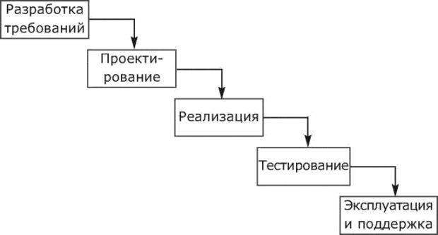
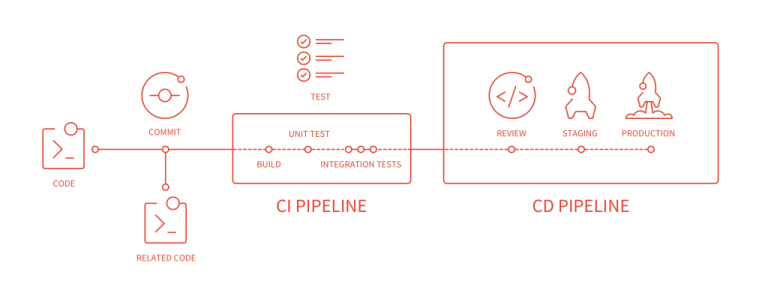
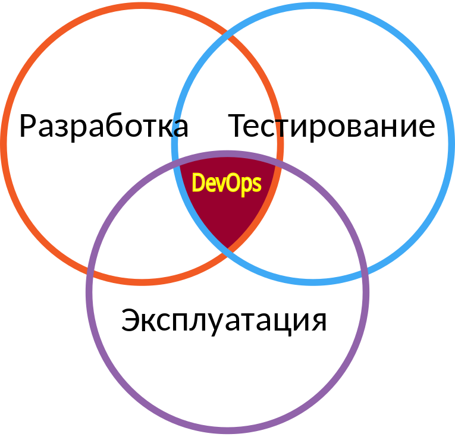
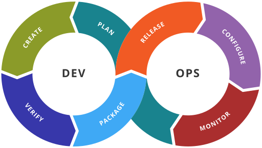
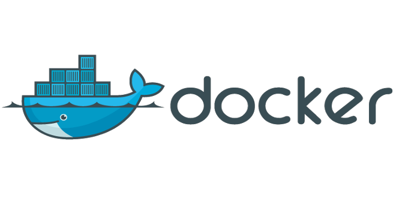

# CI & CD & DevOps

Александр Сморкалов (Intel)\
2018

# Содержание

  1. Жизненный цикл ПО
  1. CI: Непрерывная интеграция
  1. CD: Непрерывная доставка
  1. Концепция DevOps
  1. Управление инфраструктурой

# Жизненный цикл ПО

# Сращивание разработки и тестирования ПО

 1. Тестировщики — тe же программисты. Автоматизация тестирования;
 1. Программист не только кодирует по ТЗ, но и отвечает за качество, пишет тесты;
 1. Тестовые фреймворки GTest, JUnit, PyUnit, etc;
 1. Удобный для тестирования код. Моки (mocks), заглушки (stubs) и эмуляция;
 1. TDD и подобные практики в разработке.

# Continuous Integration (CI) — Непрерывная Интеграция

Это практика разработки программного обеспечения, которая заключается в слиянии
рабочих копий в общую основную ветвь разработки несколько раз в день и выполнении
частых автоматизированных сборок проекта для скорейшего выявления потенциальных
дефектов и решения интеграционных проблем.

# Эволюция подходов к интеграции

 - __Waterfall__: разделить на компоненты, реализовать, интеграция — отдельная фаза
 - __Nightly build ('90s)__: интегрироваться часто, ночной билд (heartbeet of the project)
 - __Continuous Integration ('00s)__: интегрироваться непрерывно, тестирование каждого вливания
 - __Pre-commit Testing ('10s)__: интегрироваться непрерывно но после проверки стабильности

# Практики непрерывной интеграции

1. Поддержка системы контроля версий;
1. Автоматическая сборка ПО;
1. Самотестирующийся код. Тесты разрабатываются вместе с ПО;
1. Частые, небольшие изменения в репозитории;
1. Каждое измение собирается и тестируется;
1. Построение и тестирование должно быть быстрым;
1. Тестирование в таком же окружении как и "боевое";
1. Каждый видит результаты билда;
1. Продукты билда и тестов легко доступны.

# Непрерывная интеграция (2)

 1. CI — часть процесса разработки. Входит в список Agile практик;
 1. CI диктует специфические требования к архитектуре ПО и подходам разработке:
    - хорошая модульность;
    - быстрая автоматическая сборка и тестирование;
    - тесты разрабатываются вместе с ПО, возможно TDD.
 1. CI требует инструментальной поддержки:
    - СКВ с поддержкой удобного ветвления и слияния;
    - Инструменты автоматизации сборки и тестирования;
    - CI сервер и автоматизированная платформа для тестирования ПО.

# Сращивание тестирования и развёртывания ПО

 1. При тестировании ПО должно проходить процедуры развёртывания и проверяться в
    максимально реалистичном окружении;
 1. Развёртывание ПО может быть сложным и требует автоматизации;
 1. Разработчикам требуются средства воспроизведения проблем в "боевом" окружении;
 1. Конфигурация целевой инфраструктуры становится частью разработки ПО.

# Непрерывная доставка

Подход в программной инженерии при котором команда производит и внедряет
програмное обеспечение короткими циклами убеждаясь, что ПО надёжно в любой
момент времени.

# Непрерывная доставка (2)

 1. CD — развитие идеи непрерывной интеграции, расширяющее CI на доставку ПО;
 1. CD включает не только процесс тестирования, но и вопросы развёртывания ПО;
 1. CD требует инструментальной поддержки:
    - устоявшийся CI цикл(ы);
    - инструменты для автоматического развёртывания ПО;
    - инструменты управления инфраструктурой.

# Сращивание развёртывания и эксплуатации ПО

 1. Особенности эксплуатации ПО накладывают требования на архитектуру;
 1. Эффективная эксплуатация требует дополнительной функциональности:
    - Мониторинг;
    - Масштабирование;
    - Обновление ПО, поддержка нескольких версий и совместимости со старыми версиями.

# DevOps

DevOps (акроним от англ. development и operations) — набор практик, нацеленных
на активное взаимодействие специалистов по разработке со специалистами по
информационно-технологическому обслуживанию и взаимную интеграцию их рабочих
процессов друг в друга.

# DevOps (2)

 1. Разработчики ПО активно участвуют в тестировании и развёртывнии ПО;
 1. Работа с тестами и инфраструктурой организуется в том же стиле, что и разработка ПО:
    - Инфраструктура — это код, скрипты и конфигурационные файлы хранятся в СКВ;
    - CI/CD для инфраструктурных компонентов, обзор кода;
    - Артефакт — развёрнутый сервис, группа сервисов.

# DevOps (3)

 1. Код — разработка и анализ кода, инструменты контроля версий, слияние кода;
 1. Построение — инструменты непрерывной интеграции, статус сборки;
 1. Тестирование — инструменты непрерывного тестирования, которые обеспечивают обратную связь по бизнес-рискам;
 1. Пакет — репозиторий артефактов, предварительная установка приложения;
 1. Релиз — управление изменениями, официальное утверждение выпуска, автоматизация выпуска;
 1. Конфигурация — конфигурация и управление инфраструктурой, инфраструктура как инструменты кода;
 1. Мониторинг — мониторинг производительности приложений, опыт работы с конечным пользователем.

# Задачи управления инфраструктурой

 1. Конфигурирование;
 1. Поддержка работоспособности и текущее обслуживание;
 1. Масштабирование;
 1. Балансировка нагрузки и максимально эффективная утилизация.

# Автоматическое конфигурирование платформы

 1. Размножение готового образа диска вручную или с PXE;
 1. Shell скрипты (Unix), Batch скрипты (Windows), PowerShell скрипты (Windows);
 1. Инструменты автоматического конфигурирования Chef, Solt, Puppet, Ansible.

# Виртуальные машины

Абстрагирование от реального оборудования на уровне вычислительной системы:

 1. Позволяет заранее готовить образ виртуальной машины, а не разварачивать ПО на живой системе;
 1. Позволяет размножать и переносить виртуальные системы, балансировать нагрузку;
 1. Позволяет запускать ПО в предсказуемом изолированном окружении;

# Управление виртуальными машинами: Облако

Облако — програмно-аппаратная система автоматически управляемых виртуальных машин
развёрнутых на общем оборудовании.

 1. Предоставляет интерфейс и API для развёртывания виртуальных машин;
 1. Может быть предназначено (оптимизировано) для узкого круга задач;
 1. В зависимости от уровня поддержки облако может:
    - масштабировать ресурсы виртуальной машины;
    - мигрировать приложение без остановки его работы;
    - выделять ресурсов больше физической мощности оборудования (overprovisioning);
    - может предоставлять приложения как сервис (Web Сервер, Сервер БД);
 1. Может предоставляться как коммерческое решение: Amazon AWS, Digital Ocean, Microsoft Azure, Google Compute Engine, etc.

# Преимущества и недостатки облачных решений

Преимущества:

  - Гибкость в выборе ресурсов и ОС;
  - Быстрое и лёгкое масштабирование инфраструктуры;
  - Более полная утилизация оборудования;

Недостатки:

  - Виртуализация вносит дополнительные накладные расходы, дорого запускать задачи с большим объёмом вычислений;
  - Требует сложного ПО для виртуализации, что может вносить дополнительные ограничения и факторы риска.

# Виртуализация на уровне ОС: Контейнеры

1. Контейнеры реализуют изоляцию и абстракцию на уровне приложений ОС;
1. Каждый контейнер может иметь свою файловую систему, виртуальный сетевой интерфейс и набор исполняющихся процессов;
1. Запуск и изоляцию обеспечивает ОС и системное ПО;
1. Нет накладных расходов на обеспечение виртуализации оборудования;
1. Работает как средство доставки и развёртывния ПО, так же как и виртуальная машина обеспечивает масштабирование, миграцию, переносимость.

# Docker как инструмент управления контейнерами

1. Предоставляет простой способ описания контейнеров, обеспечивает воспроизводимость;
1. Предоставляет инструменты построения и распространения контейнеров;
1. Позволяет запустить один или несколько контейнеров с разными процессами внурти;
1. Управляет выделенными ресурсами: процессорное время, память, etc;
1. Организует сетевое взаимодействие между контейнерами и внешним миром.

# Инструменты массового разворачивания контейнеров, масштабирование

1. Docker Swarm
1. Kubernetes
1. OpenShift
1. Rancher

# Serverless

1. Дальнейшее развитие идеи абстрагирования от оборудования;
1. Отказ от сервера как сущности. Функции сервера выполняет набор асинхронных
  обработчиков событий;
1. Платформа предоставляет API и соглашения о прораммировании обработчиков;
1. Обработчики событий не имеют состояния. Состояние хранится в БД;
1. Пример - Amazon Lambda.

# Ссылки

- Эндрю Хант, Дэвид Томас, "Программист-прагматик. Путь от подмастерья к мастеру";
- Конференции "Highload", "DevopsDays", "RootConf";
- Подкаст DevOps Дефлопе: <https://devopsdeflope.ru>.

# Контрольные вопросы

1. Определение непрерывной интеграции и непрерывной доставки (CI/CD)
1. Определение DevOps
1. Основные компоненты DevOps процесса
1. Виртуализация на уровне ОС, контейнеры, Docker

# Спасибо!

Вопросы?
