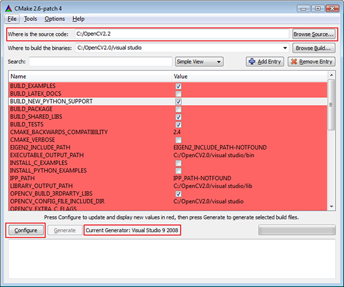

# Создание проектов


Александр Шишков (Itseez, ННГУ)\
Март 2016

<!-- TODO
  - Заменить старые CMake слайды новыми (в самом конце)
  - Убрать отсюда метапрограммирование
    - Подумать не стоит ли и IDE в отдельную лекцию (собственно разработка)
  - Вставить слайд с системами сборки для разных языков
  - Показать простой проект MSVS (аналогичный CMake)
  - Вставить ответы на задаваемые контрольные вопросы
-->

# Содержание

  1. IDE
  1. Билд-системы
  1. CMake

# IDE

> __Интегрированная среда разработки, ИСР__ (англ. __IDE, Integrated development
> environment__ или __integrated debugging environment__) — система программных
> средств, используемая программистами для разработки программного обеспечения.

В чем отличие IDE от редакторов исходного кода?

# Основные модули IDE

IDE - это не только ценный мех:

  - Текстовый редактор
  - Компилятор и/или интерпретатор
  - Средства автоматизации сборки
  - Отладчик

# Функции современных IDE

  - Автодополнение кода
  - Поддержка шаблонов проектов
  - Сниппеты
  - Поддержка систем контроля версий
  - Интеграция задач (`//TODO: ...`)
  - Браузер классов
  - Визульное редактирование классов
  - Инструменты рефакторинга
  - Профилировщик
  - Работа с СУБД, веб-сервисами
  - и т.д.

# Плагины для IDE

JetBrains [Resharper](http://www.jetbrains.com/resharper/features/index.html)

  - Статический анализ кода
  - Сниппеты
  - Инструменты рефакторинга
  - Поддержка unit-тестов
  - Инструменты автогенерации кода
  - ...

# Классификация IDE

 1. По количеству поддерживаемых языков
    - NetBeans, Xcode, Microsoft Visual Studio
    - Visual Basic, Delphi, Dev-C++

 1. Online/offline
    - NetBeans, Xcode, Microsoft Visual Studio
    - Eclipse Орион, Cloud 9 IDE, eXo Cloud IDE, ideone

# Сравнение С++ IDE

<center></center>

# Содержание

  1. IDE
  1. <font color=red>Билд-системы</font>
  1. CMake

# Цель

После написания кода приложения необходимо уметь:

  - компилировать файлы с исходным кодом
  - линковать их с библиотеками
  - распространять их как (source/binary)
  - запускать тесты

# Компиляция

Как компилировать?

 - gcc ­c a.out main.cpp

# Компиляция

А теперь представим:

 - проект содержит несколько тысяч файлов
 - некоторые файлы должны компилироваться только на некоторых ОС
 - для разных заказчиков вы должны собирать проект:
     - с разными define (DEBUG/RELEASE, LOG)
     - для разных ОС
     - для разных компиляторов
     - ...

# Линковка и другие аспекты

 - Линковка
 - Распространение приложений
     - .rpm, .msi, .dmg, .exe, InstallShield, .tar.gz, .zip, .7z, ...
 - Тестирование

# История

 - shell скрипты

compile.sh:

```tbd
#!/bin/sh
cc -c main.c
cc -c lib.c
cc -o program main.o lib.o
```

 - make, 1977 год

Makefile:

```tbd
OBJ = main.o lib.o
program: $(OBJ)
        cc -o program $(OBJ)
$(OBJ): defines.h
```

# Autotools

Makefile.am:

```tbd
bin_PROGRAMS = hello
hello_SOURCES = main.c lib.c
```

configure.ac:

```tbd
AC_INIT([program], [1.0], [sample@mail.org])
AM_INIT_AUTOMAKE([-Wall -Werror foreign])
AC_PROG_CC
AC_CONFIG_HEADERS([config.h])
AC_CONFIG_FILES([
 Makefile
])
AC_OUTPUT
```

Для запуска:

```tbd
autoreconf --install
./configure
make
```

# Autotools

Было де-факто стандартом и до сих пор используется, но:

 - слишком сложно
 - только Unix
 - sh, m4
 - зависимости

# Содержание

  1. IDE
  1. Билд-системы
  1. <font color=red>CMake</font>

# CMake

<center></center>

- Cmake
- CPack
- CTest + BullsEye/gcov
- CDash

# CMake

CMakeLists.txt

cmake / CMakeSetup / CMakeGui

=> .vcproj / Makefile / etc

Visual Studio, Eclipse, KDevelop, XCode, ...

=> .obj / .o

linker (link.exe, ld, ...)

=> .exe / .dll / .lib / .a / .so / .dylib

# Где хранятся объектные и бинарные файлы

В директории с исходным кодом:

 - src/hello.cpp
 - src/hello.exe

Вне ее:

 - src/hello.cpp
 - ­build/hello.exe

# Пример сборки

CMakeLists.txt:

```tbd
cmake_minimum_required(VERSION 2.8)
project(first_sample)

set(SOURCES main.c lib.c)
add_executable(main ${SOURCES})
```

Для запуска:

```tbd
mkdir ../build
cd ../build
cmake ../code/
make
```

# Debug/Release

 - `SET(CMAKE_BUILD_TYPE Debug)`
 - `$ cmake ­DCMAKE_BUILD_TYPE=Release ../src`

Для библиотек:

  - `TARGET_LINK_LIBRARIES(lib RELEASE ${lib_SRCS})`
  - `TARGET_LINK_LIBRARIES(libd DEBUG ${lib_SRCS})`

# Пример сборки библиотеки

CMakeLists.txt:

```cmake
cmake_minimum_required(VERSION 2.8)
project(second_sample)

set(SOURCE_LIB lib.c)
add_library(library STATIC ${SOURCE_LIB})

set(SOURCES main.c)
add_executable(main ${SOURCES})
target_link_libraries(main library)
```

# Добавление подпроекта

Содержимое каталога:

```txt
  - main.c
  - library
    - lib.c
    - lib.h
    - CMakeLists.txt
  - CMakeLists.txt
```

CMakeLists.txt:

```cmake
cmake_minimum_required(VERSION 2.8)
project(third_sample)

set(SOURCES main.c)
include_directories(library)
add_executable(main ${SOURCES})

add_subdirectory(library)
target_link_libraries(main library)
```

# Добавление подпроекта

library/CMakeLists.txt:

```cmake
cmake_minimum_required(VERSION 2.8)
project(library)

set(SOURCE_LIB lib.c)
add_library(library STATIC ${SOURCE_LIB})
```

# Поиск библиотек


# Поиск библиотек

CMakeLists.txt:

```cmake
cmake_minimum_required(VERSION 2.8)
project(sample)

find_package(OPENCV REQUIRED)
if(NOT OPENCV_FOUND)
    message(SEND_ERROR "Failed to find OpenCV")
    return()
else()
    include_directories(${OPENCV_INCLUDE_DIR})
endif()

add_executable(sample main.c)
target_link_libraries(sample ${OPENCV_LIBRARIES})
```

# Билд-системы

Популярные билд-системы:

   - [SCons](http://www.scons.org)
      - [Waf](https://code.google.com/p/waf/)
   - [Rake](https://github.com/ruby/rake)
   - [Makeit](https://bitbucket.org/grahamdumpleton/makeit)
   - [Jam](http://www.perforce.com/resources/documentation/jam)
   - [qmake](http://en.wikipedia.org/wiki/Qmake)
   - [Maven](http://maven.apache.org/)

# Резюме

  1. Использование современных IDE может существенно облегчить процесс
     разработки.
  1. Метапрограммирование позволяет динамически создавать однотипный код.
  1. Билд-системы - незаменимый инструмент при разработке кроссплатформенных
     приложений.

# Контрольные вопросы

  1. Определение ИСР
  1. Отличия ИСР от редакторов исходного кода
  1. Основные функции/возможности современных ИСР
  1. Определение метапрограммирования и его примеры
  1. Иcтория развития билд-систем
  1. Плюсы и минусы Makefile
  1. Плюсы и минусы CMake

# Ссылки

  1. <http://ru.wikipedia.org/wiki/Сравнение_IDE>
  1. <http://rus-linux.net/lib.php?name=/MyLDP/algol/lex-yacc-howto.html>
  1. <http://www.scons.org/wiki/SconsVsOtherBuildTools>

# Спасибо!

Вопросы?

<!-- LINKS -->

# BACKUP

# Метапрограммирование

>> __Метапрограммирование__ — вид программирования, связанный с созданием
>> программ, которые порождают другие программы как результат своей работы.

<center></center>

# Шаблоны в С++

```cpp
#include <iostream>

template<int N>
struct Factorial
{
    enum { value = N * Factorial\<N-1\>::value };
};

template<>
struct Factorial<1>{ enum { value = 1 }; };

int main()
{
    const int fact5 = Factorial<5>::value;
    std::cout << fact5;
    return 0;
}
```

David Abrahams and Aleksey Gurtovoy
["C++ Template Metaprogramming"](http://www.boostpro.com/mplbook/)

# cog

```python
...
/*[[[cog
import cog
fnames = ['DoSomething', 'DoAnotherThing', 'DoLastThing']
for fn in fnames:
    cog.outl("void %s();" % fn)
]]]*/
//[[[end]]]
...
```

```python
...
/*[[[cog
import cog
fnames = ['DoSomething', 'DoAnotherThing', 'DoLastThing']
for fn in fnames:
    cog.outl("void %s();" % fn)
]]]*/
void DoSomething();
void DoAnotherThing();
void DoLastThing();
//[[[end]]]
...
```

# lex & yacc

- Lex - лексический анализатор, позволяет осуществлять разбор входной
  последовательности символов с целью получения на выходе последовательности
  символов, называемых __токенами__.
- Yacc - синтаксический анализатор, который позволяет сопоставить линейной
  последовательности токенов языка его формальную грамматику.

<center></center>

# Визуальное программирование

>> __Визуальное программирование__ — способ создания программы для ЭВМ путём
>> манипулирования графическими объектами вместо написания её текста.

# Языки визульного программирования

Языки на основе объектов, когда визуальная среда программирования предоставляет
графические или символьные элементы, которыми можно манипулировать интерактивным
образом в соответствии с некоторыми правилами

  - Lego Mindstorms

<center></center>

# Языки визульного программирования

Языки, в интегрированной среде разработки которых на этапе проектирования
интерфейса применяются формы, с возможностью настройкой их свойств

  - Borland C++ Builder

<center></center>

#


# CMake

<center></center>

  - Широкая поддержка разнообразных целевых платформ и IDE
  - Максимальная свобода в выборе окружения разработки (в рамках одной команды!)
  - В настоящий момент является стандартом де-факто для С++ проектов

# CMake Workflow

`CMakeLists.txt` — файл, описывающий порядок сборки приложения

+-----------------------------+-----------------------------------------------------------------------------------+
|| - __Шаг 0__. Генерация _проектных файлов_ при помощи `cmake` или `CMakeGui`       |
|                             |     - `.vcproj, Makefile, etc`                                                    |
|                             | - __Шаг 1__. Компиляция исходников при помощи компиляторов из Visual Studio,      |
|                             |          Qt Creator, Eclipse, XCode...                                            |
|                             |     - `.obj, .o`                                                                  |
|                             | - __Шаг 2__. Линковка финальных бинарных файлов компоновщиком (link.exe, ld, ...) |
|                             |     - `.exe, .dll, .lib, .a, .so, .dylib`                                         |
+-----------------------------+-----------------------------------------------------------------------------------+

# CMake GUI



# Пример сборки приложения (`add_executable`)

Содержимое каталога:

```txt
code
├── CMakeLists.txt
├── lib.h
├── lib.c
└── main.c
```

`CMakeLists.txt`

```cmake
cmake_minimum_required(VERSION 2.8)
project(first_sample)

set(SOURCES main.c lib.c)
add_executable(sample_app ${SOURCES}) # Объявляет исполняемый модуль с именем sample_app
```

# Out of source build

__Плохо__: в директории с исходным кодом

```txt
code
├── hello.hpp
├── hello.cpp
└── hello.exe # Этот файл может случайно попасть в историю Git
```

__Хорошо__: вне директории (чистый репозиторий, несколько build-директорий)

```txt
code
├── hello.hpp
└── hello.cpp
build
└── hello.exe
```

Соответствующие команды:

```bash
$ cd <code>
$ mkdir ../build
$ cd ../build
$ cmake ../code
$ make
```

# Пример сборки библиотеки (`add_library`)

Содержимое каталога:

```txt
code
├── CMakeLists.txt
├── lib.h
├── lib.c
└── main.c
```

`CMakeLists.txt`

```cmake
cmake_minimum_required(VERSION 2.8)
project(second_sample)

set(SOURCE_LIB lib.c)
add_library(library STATIC ${SOURCE_LIB}) # Объявляет библиотеку с именем library

set(SOURCES main.c)
add_executable(main ${SOURCES}) # Объявляет исполняемый модуль с именем sample_app
target_link_libraries(sample_app library) # Указывает зависимость от библиотеки
```

# Добавление подпроекта

Содержимое каталога:

```txt
code
├── CMakeLists.txt
├── library
│   ├── CMakeLists.txt
│   ├── lib.c
│   └── lib.h
└── main.c
```

Корневой `CMakeLists.txt`:

```cmake
cmake_minimum_required(VERSION 2.8)
project(third_sample)

add_subdirectory(library) # Указывает, что в директории library есть свой CMakeLists.txt

include_directories(library)
set(SOURCES main.c)
add_executable(sample_app ${SOURCES})

target_link_libraries(sample_app library)
```

`library/CMakeLists.txt`

```cmake
cmake_minimum_required(VERSION 2.8)
project(library)

set(SOURCE_LIB lib.c)
add_library(library STATIC ${SOURCE_LIB})
```

# Поиск зависимостей

`CMakeLists.txt`

```cmake
cmake_minimum_required(VERSION 2.8)
project(sample)

# Поиск OpenCV
find_package(OPENCV REQUIRED)
if(NOT OPENCV_FOUND)
    message(SEND_ERROR "Failed to find OpenCV")
    return()
else()
    include_directories(${OPENCV_INCLUDE_DIR})
endif()

add_executable(sample_app main.c)
target_link_libraries(sample_app ${OPENCV_LIBRARIES})
```

# Debug / Release

В `CMakeLists.txt`:

```cmake
SET(CMAKE_BUILD_TYPE Debug)
```

В командной строке:

```bash
$ cmake -­DCMAKE_BUILD_TYPE=Debug ../code # Запомните эту команду!
```

Для библиотек:

```cmake
TARGET_LINK_LIBRARIES(lib RELEASE ${lib_SRCS})
TARGET_LINK_LIBRARIES(libd DEBUG ${lib_SRCS})
```

# CMake: Резюме

  - Основной "недостаток" — собственный язык
  - Поначалу инструмент кажется нетривиальным, но очень удобен впоследствии
  - Дает членам команды максимальную свободу в выборе инструментов\
    (OC, IDE или простой текстовый редактор)
  - Обеспечивает переносимость и является стандартом де-факто\
    для кросс-платформенных С++ проектов
