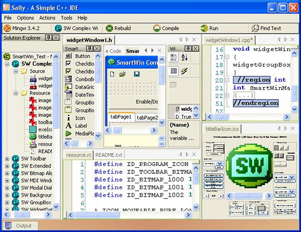

# Создание проектов



Александр Шишков (Itseez, ННГУ)\
15 октября 2013

<!-- TODO
  - Убрать отсюда метапрограммирование
    - Подумать не стоит ли и IDE в отдельную лекцию (собственно разработка)
  - Вставить слайд с системами сборки для разных языков
  - Показать простой проект MSVS (аналогичный CMake)
  - Вставить ответы на задаваемые контрольные вопросы
-->

# Содержание

  1. IDE
  1. Автогенерация кода, метапрограммирование
  1. Билд-системы

# IDE

> **Интегрированная среда разработки, ИСР** (англ. **IDE, Integrated development
> environment** или **integrated debugging environment**) — система программных
> средств, используемая программистами для разработки программного обеспечения.

В чем отличие IDE от редакторов исходного кода?

# Основные модули IDE

IDE - это не только ценный мех:

  - Текстовый редактор
  - Компилятор и/или интерпретатор
  - Средства автоматизации сборки
  - Отладчик

# Функции современных IDE

   - Автодополнение кода
   - Поддержка шаблонов проектов
   - Сниппеты
   - Поддержка систем контроля версий
   - Интеграция задач (`//TODO: ...`)
   - Браузер классов
   - Визульное редактирование классов
   - Инструменты рефакторинга
   - Профилировщик
   - Работа с СУБД, веб-сервисами
   - ...

# Плагины для IDE

JetBrains [Resharper](http://www.jetbrains.com/resharper/features/index.html)

  - Статический анализ кода
  - Сниппеты
  - Инструменты рефакторинга
  - Поддержка unit-тестов
  - Инструменты автогенерации кода
  - ...

# Классификация IDE

 1. По количеству поддерживаемых языков
    - NetBeans, Xcode, Microsoft Visual Studio
    - Visual Basic, Delphi, Dev-C++

 1. Online/offline
    - NetBeans, Xcode, Microsoft Visual Studio
    - Eclipse Орион, Cloud 9 IDE, eXo Cloud IDE, ideone

# Сравнение С++ IDE

<center></center>

# Содержание

  1. IDE
  1. <font color=red>Автогенерация кода, метапрограммирование</font>
  1. Билд-системы

# Метапрограммирование

>> **Метапрограммирование** — вид программирования, связанный с созданием
>> программ, которые порождают другие программы как результат своей работы.

<center></center>

# Шаблоны в С++

```
#include <iostream>

template<int N>
struct Factorial
{
    enum { value = N * Factorial\<N-1\>::value };
};

template<>
struct Factorial<1>{ enum { value = 1 }; };

int main()
{
    const int fact5 = Factorial<5>::value;
    std::cout << fact5;
    return 0;
}
```

David Abrahams and Aleksey Gurtovoy
["C++ Template Metaprogramming"](http://www.boostpro.com/mplbook/)

# cog

<pre>
...
/*[[[cog
import cog
fnames = ['DoSomething', 'DoAnotherThing', 'DoLastThing']
for fn in fnames:
    cog.outl("void %s();" % fn)
]]]*/
//[[[end]]]
...
</pre>

<pre>
...
/*[[[cog
import cog
fnames = ['DoSomething', 'DoAnotherThing', 'DoLastThing']
for fn in fnames:
    cog.outl("void %s();" % fn)
]]]*/
void DoSomething();
void DoAnotherThing();
void DoLastThing();
//[[[end]]]
...
</pre>

# lex & yacc

- Lex - лексический анализатор, позволяет осуществлять разбор входной
  последовательности символов с целью получения на выходе последовательности
  символов, называемых **токенами**.
- Yacc - синтаксический анализатор, который позволяет сопоставить линейной
  последовательности токенов языка его формальную грамматику.

<center></center>

# Визуальное программирование

>> **Визуальное программирование** — способ создания программы для ЭВМ путём
>> манипулирования графическими объектами вместо написания её текста.

# Языки визульного программирования

Языки на основе объектов, когда визуальная среда программирования предоставляет
графические или символьные элементы, которыми можно манипулировать интерактивным
образом в соответствии с некоторыми правилами

  - Lego Mindstorms

<center></center>

# Языки визульного программирования

Языки, в интегрированной среде разработки которых на этапе проектирования
интерфейса применяются формы, с возможностью настройкой их свойств

  - Borland C++ Builder

<center></center>

# Содержание

  1. IDE
  1. Автогенерация кода, метапрограммирование
  1. <font color=red>Билд-системы</font>

# История

 - shell скрипты

compile.sh:

<pre>
#!/bin/sh
cc -c main.c
cc -c lib.c
cc -o program main.o lib.o
</pre>

 - make, 1977 год

Makefile:

```
OBJ = main.o lib.o
program: $(OBJ)
        cc -o program $(OBJ)
$(OBJ): defines.h
```

# Autotools

Makefile.am:
<pre>
bin_PROGRAMS = hello
hello_SOURCES = main.c lib.c
</pre>

configure.ac:
<pre>
AC_INIT([program], [1.0], [sample@mail.org])
AM_INIT_AUTOMAKE([-Wall -Werror foreign])
AC_PROG_CC
AC_CONFIG_HEADERS([config.h])
AC_CONFIG_FILES([
 Makefile
])
AC_OUTPUT
</pre>

Для запуска:
<pre>
autoreconf --install
./configure
make
</pre>

# CMake

<center></center>

# Пример сборки

CMakeLists.txt:

<pre>
cmake_minimum_required(VERSION 2.8)
project(first_sample)

set(SOURCES main.c lib.c)
add_executable(main ${SOURCES})
</pre>

Для запуска:

<pre>
mkdir ../build
cd ../build
cmake ../code/
make
</pre>

# Пример сборки библиотеки

CMakeLists.txt:

<pre>
cmake_minimum_required(VERSION 2.8)
project(second_sample)

set(SOURCE_LIB lib.c)
add_library(library STATIC ${SOURCE_LIB})

set(SOURCES main.c)
add_executable(main ${SOURCES})
target_link_libraries(main library)
</pre>

# Добавление подпроекта

Содержимое каталога:
<pre>
  - main.c
  - library
    - lib.c
    - lib.h
    - CMakeLists.txt
  - CMakeLists.txt
</pre>

CMakeLists.txt:
<pre>
cmake_minimum_required(VERSION 2.8)
project(third_sample)

set(SOURCES main.c)
include_directories(library)
add_executable(main ${SOURCES})

add_subdirectory(library)
target_link_libraries(main library)
</pre>

library/CMakeLists.txt:
<pre>
cmake_minimum_required(VERSION 2.8)
project(library)

set(SOURCE_LIB lib.c)
add_library(library STATIC ${SOURCE_LIB})
</pre>

# Поиск библиотек

CMakeLists.txt:
<pre>
cmake_minimum_required(VERSION 2.8)
project(sample)

find_package(OPENCV REQUIRED)
if(NOT OPENCV_FOUND)
    message(SEND_ERROR "Failed to find OpenCV")
    return()
else()
    include_directories(${OPENCV_INCLUDE_DIR})
endif()

add_executable(sample main.c)
target_link_libraries(sample ${OPENCV_LIBRARIES})
</pre>

# Билд-системы

Популярные билд-системы:

   - [SCons](http://www.scons.org)
      - [Waf](http://freehackers.org/~tnagy/waf.html)
   - [Rake](http://rake.rubyforge.org/)
   - [Makeit](http://www.dscpl.com.au/projects/makeit/)
   - [Jam](http://www.perforce.com/resources/documentation/jam)
   - [qmake](http://doc.trolltech.com/3.0/qmake.html)
   - [Maven](http://maven.apache.org/)

# Резюме

  1. Использование современных IDE может существенно облегчить процесс
     разработки.
  1. Метапрограммирование позволяет динамически создавать однотипный код.
  1. Билд-системы - незаменимый инструмент при разработке кроссплатформенных
     приложений.

# Контрольные вопросы

  1. Определение ИСР
  1. Отличия ИСР от редакторов исходного кода
  1. Основные функции/возможности современных ИСР
  1. Определение метапрограммирования и его примеры
  1. Иcтория развития билд-систем
  1. Плюсы и минусы Makefile
  1. Плюсы и минусы CMake

# Ссылки

  1. <http://ru.wikipedia.org/wiki/Сравнение_IDE>
  1. <http://rus-linux.net/lib.php?name=/MyLDP/algol/lex-yacc-howto.html>
  1. <http://www.scons.org/wiki/SconsVsOtherBuildTools>

# Спасибо!

Вопросы?
