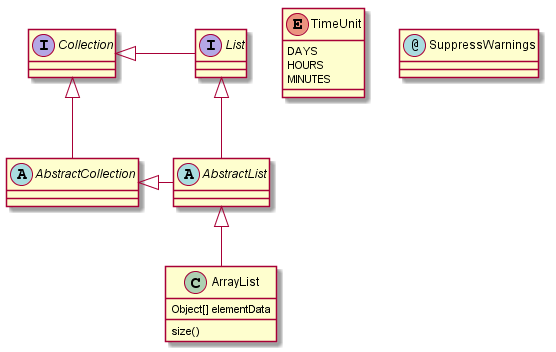
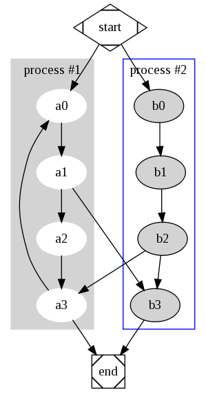
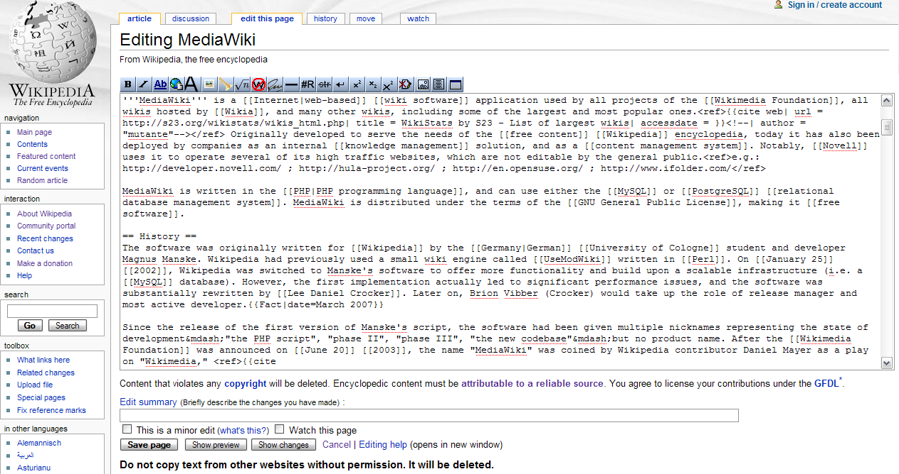
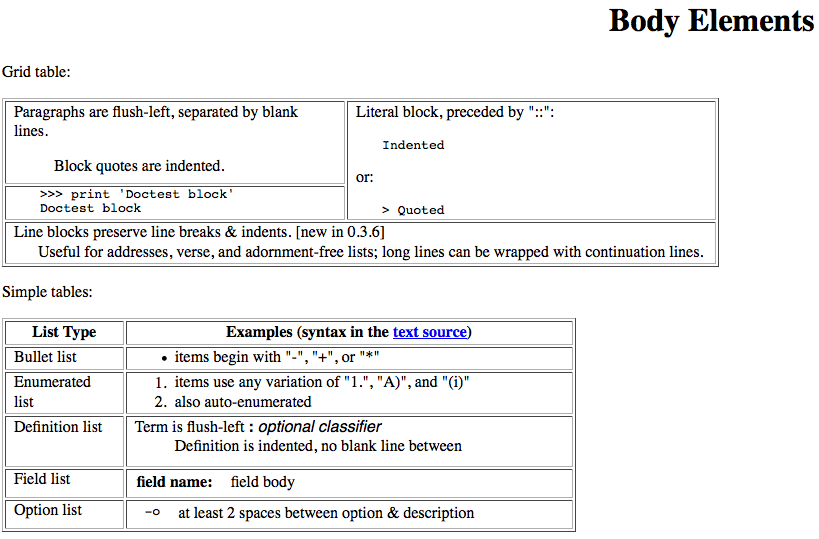
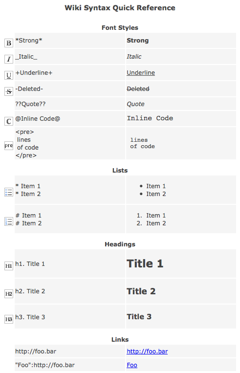
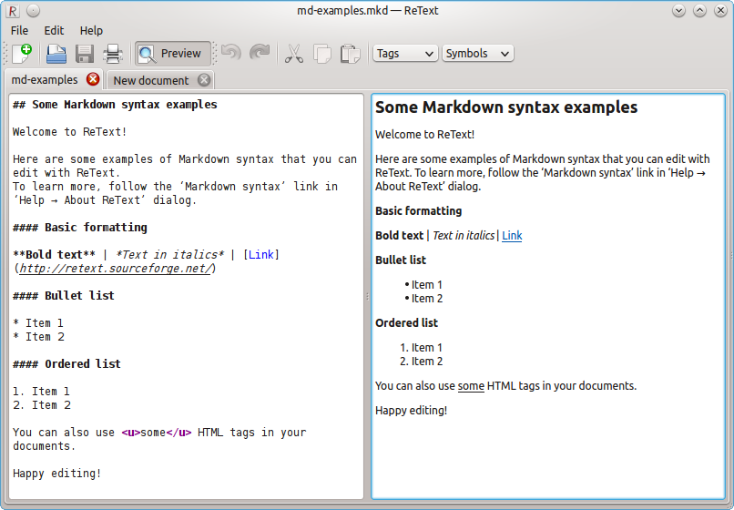
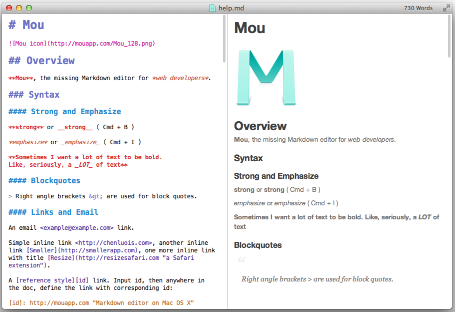
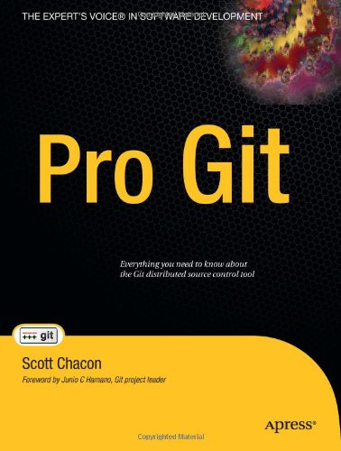

# Текстовые форматы


Кирилл Корняков (Itseez, ННГУ)\
Апрель 2016

<!-- TODO
  - Свести все ссылки в конец файла
  - Возможно стоит переименовать картинки
  - Более четко обозначить примеры использования форматов файлов
-->

# Содержание

 1. Сравнение бинарного и текстового форматов
 1. Популярные форматы на основе текстового
 1. Текстовые файлы как исходники
 1. Легковесные языки разметки
 1. Примеры использования Markdown

# Форматы: текстовый

__Текстовый файл__ — компьютерный файл, содержащий текстовые данные,\
как правило, организованные в виде строк.

Пример CSV-файла:

```tbd
1997, Ford, E350, "ac, abs, moon", 3000.00
1999, Chevy, "Venture ""Extended Edition""", "", 4900.00
1996, Jeep, Grand Cherokee, "MUST SELL! air, moon roof, loaded", 4799.00
```

# Форматы: бинарный

__Двоичный (бинарный) файл__ — в широком смысле: последовательность произвольных
байтов.

В узком смысле слова двоичные файлы противопоставляются текстовым файлам.

```hex
00000000  89 50 4e 47 0d 0a 1a 0a  00 00 00 0d 49 48 44 52  |.PNG........IHDR|
00000010  00 00 00 87 00 00 00 a0  08 03 00 00 00 11 90 8f  |................|
00000020  b6 00 00 00 04 67 41 4d  41 00 00 d6 d8 d4 4f 58  |.....gAMA.....OX|
00000030  32 00 00 00 19 74 45 58  74 53 6f 66 74 77 61 72  |2....tEXtSoftwar|
00000040  65 00 41 64 6f 62 65 20  49 6d 61 67 65 52 65 61  |e.Adobe ImageRea|
00000050  64 79 71 c9 65 3c 00 00  03 00 50 4c 54 45 22 22  |dyq.e<....PLTE""|
00000060  22 56 56 56 47 47 47 33  33 33 30 30 30 42 42 42  |"VVVGGG333000BBB|
00000070  4b 4b 4b 40 40 40 15 15  15 4f 4f 4f 2c 2c 2c 3c  |KKK@@@...OOO,,,<|
00000080  3c 3c 3e 3e 3e 3a 39 39  04 04 04 1d 1d 1d 35 35  |<<>>>:99......55|
00000090  35 51 50 50 37 37 37 11  11 11 25 25 25 0d 0d 0d  |5QPP777...%%%...|
000000a0  27 27 27 1a 1a 1a 38 38  38 2a 2a 2a 08 08 08 20  |'''...888**... |
000000b0  20 20 17 17 17 2e 2e 2e  13 13 13 bb bb bb 88 88  |  ..............|
```

# Преимущества бинарного формата

  1. __Минимальный размер__ — не содержат "разметки", часто являются сжатыми.
  1. __Машинное представление__ данных, иногда допускает прямую (а значит
     быструю) загрузку в оперативную память (например сериализованные структуры
     данных). Нет необходимости в конверсии.
  1. __Эффективность__ некоторых операций: поиск элементов, иногда вставка и
     удаление.

# Преимущества текстового формата

  1. __Воспринимаемость человеком__ — просто понять структуру и содержание,
     часто без документации и специальных инструментальных средств.
  1. __Простота__ — формат крайне удобен и его можно редактировать огромным
     количеством инструментов. И в первую очередь простым текстовым редактором.
  1. __Версионируемость__ — файлы легко сравнивать, находить изменения.
  1. __Переносимость__ — текстовый файл может быть прочитан на любой системе или
     ОС.
  1. __Устойчивость__ — каждое слово и символ в таком файле самодостаточны и,
     если случится повреждение байтов в таком файле, то обычно можно
     восстановить данные или продолжить обработку остального содержимого.

В эпоху быстрых компьютеров и дешевой памяти эти преимущества побеждают.

<!-- TOC -->

# Популярные форматы: TXT

_BSD 3-Clause License_

```txt
Redistribution and use in source and binary forms, with or without
modification, are permitted provided that the following conditions are
met:

    (1) Redistributions of source code must retain the above copyright
    notice, this list of conditions and the following disclaimer.

    (2) Redistributions in binary form must reproduce the above copyright
    notice, this list of conditions and the following disclaimer in
    the documentation and/or other materials provided with the
    distribution.
```

Примеры использования:

 - Документация (README, Changelog, TODO)
 - Логи (отладочная информация, coredump)
 - Консольный вывод утилит (разнообразные анализаторы)

# Популярные форматы: XML

_Google Test_ output

```xml
<?xml version="1.0" encoding="UTF-8"?>
<testsuites tests="1682" failures="0" disabled="0" errors="0" timestamp="2013-09-09T09:42:14" time="19.139" cv_version="2.4.6.1" cv_vcs_version="2.4.6.1-389-g6ebfa87" cv_parallel_framework="gcd" cv_cpu_features="sse sse2 sse3 ssse3" cv_module_name="core" cv_implementation="plain" cv_num_threads="-1" name="AllTests">
  <testsuite name="Size_MatType_abs" tests="16" failures="0" disabled="0" errors="0" time="3.522">
    <testcase name="abs/0" value_param="(640x480, 8SC1)" status="run" time="0.05" classname="Size_MatType_abs" bytesIn="307200" bytesOut="307200" term="0" samples="100" outliers="3" frequency="1000000000" min="459070" median="479775" gmean="484118" gstddev="0.049859" mean="484726" stddev="24937" />
    <testcase name="abs/1" value_param="(640x480, 8SC4)" status="run" time="0.209" classname="Size_MatType_abs" bytesIn="1228800" bytesOut="1228800" term="0" samples="100" outliers="1" frequency="1000000000" min="1845350" median="1916669" gmean="2025727" gstddev="0.139772" mean="2047351" stddev="329475" />
    <testcase name="abs/2" value_param="(640x480, 32SC1)" status="run" time="0.015" classname="Size_MatType_abs" bytesIn="1228800" bytesOut="1228800" term="0" samples="100" outliers="3" frequency="1000000000" min="127433" median="128503" gmean="131656" gstddev="0.052733" mean="131844" stddev="7356" />
    <testcase name="abs/3" value_param="(640x480, 32FC1)" status="run" time="0.014" classname="Size_MatType_abs" bytesIn="1228800" bytesOut="1228800" term="0" samples="100" outliers="4" frequency="1000000000" min="121615" median="123016" gmean="126257" gstddev="0.069440" mean="126578" stddev="9673" />
    <testcase name="abs/4" value_param="(1280x720, 8SC1)" status="run" time="0.144" classname="Size_MatType_abs" bytesIn="921600" bytesOut="921600" term="0" samples="100" outliers="2" frequency="1000000000" min="1380084" median="1415141" gmean="1428763" gstddev="0.035451" mean="1429665" stddev="51832" />
    <testcase name="abs/5" value_param="(1280x720, 8SC4)" status="run" time="0.728" classname="Size_MatType_abs" bytesIn="3686400" bytesOut="3686400" term="0" samples="100" outliers="0" frequency="1000000000" min="5582443" median="6556922" gmean="7039714" gstddev="0.205895" mean="7193720" stddev="1551553" />
    <testcase name="abs/6" value_param="(1280x720, 32SC1)" status="run" time="0.078" classname="Size_MatType_abs" bytesIn="3686400" bytesOut="3686400" term="0" samples="100" outliers="1" frequency="1000000000" min="589331" median="666260" gmean="684319" gstddev="0.110956" mean="688650" stddev="80689" />
    <testcase name="abs/7" value_param="(1280x720, 32FC1)" status="run" time="0.07" classname="Size_MatType_abs" bytesIn="3686400"
    ...>
```

Примеры использования:

 - Отчеты различных утилит (результаты тестирования)
 - Сериализация структур данных
 - Конфигурационные файлы (в том числе для построения)

# Популярные форматы: YAML

Конфигурационный файл _Travis CI_

```yaml
language: cpp
compiler:
  - gcc
  - clang
before_script:
  - ./configure --enable-version=18
script: rake travis
branches:
  only:
    - master
    - compiler
notifications:
  recipients:
    - somebody@gmail.com
  email:
    on_success: change
    on_failure: always
rvm:
  - 1.8.7
  - 1.9.3
```

 - Конфигурационные файлы
 - Сериализованные данные

# Популярные форматы: JSON

```json
{
   "firstName": "Иван",
   "lastName": "Иванов",
   "address": {
       "streetAddress": "Московское ш., 101, кв.101",
       "city": "Ленинград",
       "postalCode": 101101
   },
   "phoneNumbers": [
       "812 123-1234",
       "916 123-4567"
   ]
}
```

Основное использование — сериализация структур, часто в веб-приложениях.

Функционально и синтаксически является подмножеством YAML.

<!-- TOC -->

# Текст как исходник

 1. Все языки программирования используют текстовый формат как исходный.
    В том числе и ассемблер.
 1. А некоторые языки, и как конечный формат распространения:
    - Скриптовые языки: bash, CMD
    - Динамические языки: Python, Perl, Ruby
    - Другие: JavaScript, MATLAB, GLSL, OpenCL (< v1.2?), CMake

Открытость исходника позволяет:

  - Читать и изучать
  - Модифицировать и переиспользовать
  - Генерировать

# Doxygen

+--------------------------------------------------------+----------------------------+
|```cpp                                                  ||
|/**                                                     |                            |
| * @file                                                |                            |
| * @author  John Doe <jdoe@example.com>                 |                            |
| * @version 1.0                                         |                            |
| * @section DESCRIPTION                                 |                            |
| * The time class represents a moment of time.          |                            |
| */                                                     |                            |
|                                                        |                            |
|class Time {                                            |                            |
| public:                                                |                            |
|    /**                                                 |                            |
|     * Constructor that sets the time to a given value. |                            |
|     *                                                  |                            |
|     * @param timemillis Number of milliseconds         |                            |
|     *        passed since Jan 1, 1970.                 |                            |
|     */                                                 |                            |
|    Time (int timemillis);                              |                            |
|                                                        |                            |
|    /**                                                 |                            |
|     * Get the current time.                            |                            |
|     *                                                  |                            |
|     * @return A time object set to the current time.   |                            |
|     */                                                 |                            |
|    static Time now ();                                 |                            |
|};                                                      |                            |
|```                                                     |                            |
+--------------------------------------------------------+----------------------------+

# PlantUML

+------------------------------------+---------------------------+
|```cpp                              |                           |
|@startuml                           | |
|                                    |                           |
|abstract class AbstractList         |                           |
|abstract AbstractCollection         |                           |
|interface List                      |                           |
|interface Collection                |                           |
|                                    |                           |
|List <|-- AbstractList              |                           |
|Collection <|-- AbstractCollection  |                           |
|                                    |                           |
|Collection <|- List                 |                           |
|AbstractCollection <|- AbstractList |                           |
|AbstractList <|-- ArrayList         |                           |
|                                    |                           |
|class ArrayList {                   |                           |
|  Object[] elementData              |                           |
|  size()                            |                           |
|}                                   |                           |
|                                    |                           |
|enum TimeUnit {                     |                           |
|  DAYS                              |                           |
|  HOURS                             |                           |
|  MINUTES                           |                           |
|}                                   |                           |
|                                    |                           |
|annotation SuppressWarnings         |                           |
|                                    |                           |
|@enduml                             |                           |
|```                                 |                           |
+------------------------------------+---------------------------+

# Graphviz

+-------------------------------------+-----------------------+
|```tbd                               | |
|digraph G {                          |                       |
|                                     |                       |
|  subgraph cluster_0 {               |                       |
|    style=filled;                    |                       |
|    color=lightgrey;                 |                       |
|    node [style=filled,color=white]; |                       |
|    a0 -> a1 -> a2 -> a3;            |                       |
|    label = "process #1";            |                       |
|  }                                  |                       |
|                                     |                       |
|  subgraph cluster_1 {               |                       |
|    node [style=filled];             |                       |
|    b0 -> b1 -> b2 -> b3;            |                       |
|    label = "process #2";            |                       |
|    color=blue                       |                       |
|  }                                  |                       |
|  start -> a0;                       |                       |
|  start -> b0;                       |                       |
|  a1 -> b3;                          |                       |
|  b2 -> a3;                          |                       |
|  a3 -> a0;                          |                       |
|  a3 -> end;                         |                       |
|  b3 -> end;                         |                       |
|                                     |                       |
|  start [shape=Mdiamond];            |                       |
|  end [shape=Msquare];               |                       |
|}                                    |                       |
|```                                  |                       |
+-------------------------------------+-----------------------+

# LaTeX

+-----------------------------------------------+--------------------------------+
|```tbd                                         | |
|\documentclass[12pt]{article}                  |                                |
|\usepackage{amsmath}                           |                                |
|\title{\LaTeX}                                 |                                |
|\date{}                                        |                                |
|\begin{document}                               |                                |
|  \maketitle                                   |                                |
|  \LaTeX{} is a document preparation system    |                                |
|  for the \TeX{} typesetting program. It offers|                                |
|  ...                                          |                                |
|  using \TeX; few people write in plain \TeX{} |                                |
|  anymore. The current version is \LaTeXe.     |                                |
|                                               |                                |
|  % This is a comment, not shown in final      |                                |
|  % output. The following shows typesetting    |                                |
|  % power of LaTeX:                            |                                |
|  \begin{align}                                |                                |
|    E &= mc^2                              \\  |                                |
|    m &= \frac{m_0}{\sqrt{1-\frac{v^2}{c^2}}}  |                                |
|  \end{align}                                  |                                |
|\end{document}                                 |                                |
|```                                            |                                |
+-----------------------------------------------+--------------------------------+

Идеален для больших научных текстов (статей, книг).

<!-- TOC -->

# Легковесные языки разметки

__Определение__

  - Это языки разметки текстовой информации
  - Имеют упрощенный синтаксис
  - Ориентированы для редактирования из простого текстового редактора
  - Понятны человеку в своем исходном виде

__Приложения__

  - Wiki страницы
  - Документация
  - Веб-публикации (блоги, сайты), см. результаты
    [голосования](http://habrahabr.ru/post/129212/)

Смотри также [каталог](http://en.wikipedia.org/wiki/Lightweight_markup_language)
на Wikipedia.

# MediaWiki



# reStructuredText

```rst
Body Elements
=============
Grid table:

+--------------------------------+-----------------------------------+
| Paragraphs are flush-left,     | Literal block, preceded by "::":: |
| separated by blank lines.      |                                   |
|                                |     Indented                      |
|     Block quotes are indented. |                                   |
+--------------------------------+ or::                              |
| >>> print 'Doctest block'      |                                   |
| Doctest block                  | > Quoted                          |
+--------------------------------+-----------------------------------+
| | Line blocks preserve line breaks & indents. [new in 0.3.6]       |
| |     Useful for addresses, verse, and adornment-free lists; long  |
|       lines can be wrapped with continuation lines.                |
+--------------------------------------------------------------------+

Simple tables:

================  ============================================================
List Type         Examples (syntax in the `text source <cheatsheet.txt>`_)
================  ============================================================
Bullet list       * items begin with "-", "+", or "*"
Enumerated list   1. items use any variation of "1.", "A)", and "(i)"
                  #. also auto-enumerated
Definition list   Term is flush-left : optional classifier
                      Definition is indented, no blank line between
Field list        :field name: field body
Option list       -o  at least 2 spaces between option & description
================  ============================================================
```

From the [cheatsheet](http://docutils.sourceforge.net/docs/user/rst/cheatsheet.txt).

# reStructuredText

Создан при помощи онлайн [рендера](http://www.tele3.cz/jbar/rest/rest.html) от Jiri Barton.



# Textile

Этот синтаксис используется например в Redmine.
GitHub также позволяет использовать его.



# AsciiDoc

Описание <http://www.methods.co.nz/asciidoc/>

# Markdown

 - Вероятно, самый популярный из легковесных языков разметки на сегодняшний
   день.
 - Используется на StackOverflow и GitHub в качестве языка для wiki и
   комментариев.
 - Поддерживается редакторами, оброс большим количеством инструментов.
 - Минус: встречаются расхождения в "толковании". Но уже есть
   [CommonMark][commonmark]!

# Полезные Markdown ссылки

  1. [CommonMark][commonmark]
  1. [Шпаргалка](https://github.com/adam-p/markdown-here/wiki/Markdown-Cheatsheet)
  1. [GitHub Flavored Markdown](https://help.github.com/articles/github-flavored-markdown)
  1. [Оригинальная страница](http://daringfireball.net/projects/markdown/syntax)
  1. <http://WhatIsMarkdown.com>

# Markdown

_ReText_ client for Linux



# Markdown

_Mou_ client for Mac



# Pandoc

  - [Pandoc](http://johnmacfarlane.net/pandoc/) - это инструмент для конвертации
    различных языков разметки друг в друга.
  - В том числе и для экспорта в форматы для публикации (html, docx, pdf).
  - Разрабатывается на языке Haskell профессором философии из Беркли.
  - Проект разрабатывается на [GitHub](https://github.com/jgm/pandoc).

Эти слайды созданы путем генерации HTML из Markdown при помощи Pandoc.

<!-- TOC -->

# Примеры использования Markdown

  1. GitHub: wiki and comments using GFM.
  2. StackOverflow: questions and answers [editing](http://stackoverflow.com/editing-help).
  3. Askbot: the same as StackOverflow.

# ProGit book

+----------------------------------------------+---------------------+
| - Одна из лучших книг про Git                ||
|                                              |                     |
| - Книга свободно                             |                     |
|   [доступна](http://git-scm.com/book)        |                     |
|   в различных форматах                       |                     |
|   (html, pdf, epub, mobi)                    |                     |
|                                              |                     |
| - Markdown-исходник размещен на              |                     |
|   [GitHub](https://github.com/progit/progit) |                     |
|                                              |                     |
| - Переведена и улучшена энтузиастами со всего|                     |
|   мира (9 полных переводов, 12 частичных)    |                     |
+----------------------------------------------+---------------------+

# Презентации с Markdown

  - Pandoc [позволяет создавать слайды](http://johnmacfarlane.net/pandoc/demo/example9/producing-slide-shows-with-pandoc.html)
    на основе Markdown
  - Развернутый обзор можно найти [здесь](https://chronicle.com/blogs/profhacker/markdown-slideshow-example-pandoc/46683)
  - В нашем случае используется движок [Slidy](http://www.w3.org/Talks/Tools/Slidy/)

Если возможностей покажется мало, то стоит обратить внимание на

  - HTML Presentation Framework [Reveal.js](http://lab.hakim.se/reveal-js/#/)
  - Presentation tool [Impress.js][impress]

# Статические сайты с Jekyll

  - [Jekyll](http://jekyllrb.com/) - это генератор статических сайтов на основе
    Markdown или Textile.
  - Позволяет отделить содержание от оформления, что дает гибкость.
  - Примеры
    - [Rasmus Andersson](http://rsms.me/archive/) ([source](https://github.com/rsms/rsms.github.com))
    - [Nick Quaranto](http://quaran.to/) ([source](https://github.com/qrush/qrush.github.com))
    - [GitHub teaching](http://teach.github.com/) ([source](https://github.com/github/teach.github.com))
    - Minimal mistakes [theme](http://mmistakes.github.io/minimal-mistakes/articles/)

# Контрольные вопросы

  1. Преимущества и недостатки простого текста.
  1. Преимущества и недостатки бинарного формата.
  1. Примеры ситуаций, когда удобно использовать TXT, XML, YAML, JSON.
  1. Легковесные языки разметки. Примеры, назначение, преимущества и недостатки.
  1. Синтаксис Markdown (заголовки, стили, списки, ссылки).
  1. Примеры использования Markdown, в том числе нестандартные. В чем
     преимущество использования Markdown в каждой из этих ситуаций.

# Спасибо!

Вопросы?

<!-- LINKS -->

[commonmark]: http://commonmark.org
[impress]: http://impress.github.io/impress.js
