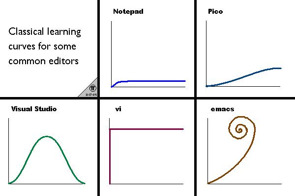

# Обработка текста

Кирилл Корняков (Intel, ННГУ)\
Март 2018

<!-- TODO
 - разбить на 2 части, оставить только пункты 1-3
 - мб вставить интересные факты
 - вызов текстового редактора из командной строки
 - Как насчет всего закомментированного кода
 - vim demo
   - https://www.youtube.com/watch?v=lQNFfhC4QI8

 - '/^#(?:(?:[a-fd]{3}){1,2})$/i'
 - What is `|` in regexp syntax
-->

# Содержание

  1. Текстовые редакторы
  2. Возможности современных редакторов (на примере Sublime Text)
  3. Регулярные выражения

# Два совета

  1. Освойте слепой метод печати
     - Вы начинаете работать "со скоростью мысли"
     - Мозгу не нужно переключаться, вы фокусируетесь на задаче
     - Это полезно для глаз
     - Тренажеры: [русский](http://vse10.ru), [английский](http://www.ratatype.com)
  2. Избегайте использования мыши
     - Экономия до 30% рабочего времени
     - Освойте клавиатурные комбинации ("горячие клавиши")

# Текстовые редакторы

> Используйте один текстовый редактор, но по максимуму.

Дэвид Хант, Андрю Томас "Программист-прагматик"

> Найдите идеальный для себя редактор и досконально изучите его.

Нил Форд, "Продуктивный программист"

# Важные свойства редакторов

 - Кросс-платформенность
 - Настраиваемость
    - Шрифты, оформление, клавиатурные комбинации
 - Расширяемость
    - Новые языки программирования и форматы файлов
 - Программируемость
    - Программируемость сложных операций (макросы, сценарии)
 - Скорость работы

# Learning Curves

# Vim

+-----------------------+------------------------------------------------------------------------------+
|| - Vim — свободный текстовый редактор, созданный на базе vi.                  |
|                       | - Один из культовых редакторов.                                              |
|                       | - Один из мощнейших редакторов, с полной свободой настройки и автоматизации. |
|                       | - Имеет огромное количество расширений (более 3000).                         |
|                       | - Используется практически в любых проектах.                                 |
|                       | - Официальный сайт проекта: <http://www.vim.org>.                            |
+-----------------------+------------------------------------------------------------------------------+

# Vim UI

# Vim Cheatsheet

# Vim examples

 - `5D`, `Y5p` — удалить/повторить строку 5 раз
 - `/^joe` — найти все строки, начинающиеся с joe
 - `:g!/REGEXP/d` — удалить все строки, не содержащие REGEXP
 - `:%norm jdd` — удалить каждую вторую строку
 - `ci(`, `ci[` — удалить содержимое внутри скобок
 - `guu`, `gUU` — перевести всю строку в нижний/верхний регистр

Настройки Vim

 - `:history` — показать историю команд
 - `:set number` — показать номера строк

# Emacs

+--------------------+----------------------------------------------------------------------------+
|| - Emacs — семейство расширяемых многофункциональных текстовых редакторов.  |
|                    | - Второй культовый редактор.                                               |
|                    | - Возможно еще более мощный редактор, чем Vim (Emacs as an OS).               |
|                    | - Имеет более 2000 встроенных команд, позволяет комбинировать их в макросы.|
|                    | - Официальный сайт проекта <http://www.gnu.org/software/emacs>.            |
+--------------------+----------------------------------------------------------------------------+

# Emacs UI

# Идеология Emacs

  - "Всё в одном"
    - Функциональность: базовая, основной режим, дополнительные режимы
  - Расширяемость
    - Программируется на Elisp, имеются пакеты расширений, клавиатурные
      комбинации
  - Настраиваемость под пользователя
    - Elisp-переменные, определение функций, создание hook'ов
  - Документированность
    - Подробная документация, вплоть до функций и переменных

# Sublime Text

+---------------------------+--------------------------------------------------------------+
|| - Sublime Text — кроссплатформенный редактор текста и кода.  |
|                           | - Имеет Python API, существует большое количество раширений. |
|                           | - Не является свободным, однако почти все расширения открыты.|
|                           | - Официальный сайт проекта <http://www.sublimetext.com>.    |
+---------------------------+--------------------------------------------------------------+

# Sublime Text UI

# Sublime Text: Горячие клавиши

# Содержание

  1. Текстовые редакторы
  2. Возможности современных редакторов (на примере Sublime)
  3. Регулярные выражения

# Навигация

  1. По файлам
     - Перебор закладок
     - Боковая панель
     - __Go to anything__
  1. Внутри файлов
     - Хождение по словам, строкам, экрану
     - Переход на строку
     - Переход между скобками
     - __Go to symbol__

# Выделение

  1. Слов, Строк
  1. Абзацев
  1. Выражений внутри скобок
  1. Всех вхождений слова => Поиск

# Поиск

  1. Простой поиск
     - __Multiple cursor__
     - __Регулярные выражения__
  1. Инкрементальный
  1. Быстрый

# Редактирование

  1. Комментирование
  1. Перестановка двух символов
  1. Удаление: слов, строк, окончаний строк
  1. Манипуляции со строками
     - Дублирование, переупорядочение, сортировка
     - Слияние и автоматический перенос
  1. Редактирование нескольких строк и прямоугольных регионов

# Продвинутые возможности

  1. Package Control
  1. Snippets
  1. Vintage Mode
  1. Custom Builds
  1. Projects

# Содержание

  1. Текстовые редакторы
  2. Возможности современных редакторов (на примере Sublime)
  3. Регулярные выражения

# Регулярные выражения

> __Регулярные выражения__ (англ. regular expressions) — формальный язык поиска
и осуществления манипуляций с подстроками в тексте, основанный на использовании
метасимволов (англ. wildcard characters).

> По сути это строка-образец (англ. pattern, по-русски её часто называют
«шаблоном», «маской»), состоящая из символов и метасимволов, и задающая правило
поиска.

Wikipedia

Метасимволы: `[ ] \ / ^ $ . | ? * + ( ) { }`

# Примеры регулярных выражений

  - `polynomial`
  - `3\.1415926`
  - `static`
  - ` static .*(.*;`
  - `^class`
  - `[0-9]{6}`

# Синтаксис

  - Обычные строки обозначают сами себя
  - `.` — может быть использована вместо любого символа
  - `\` — экранирует метасимволы (`/` иногда используется как разделитель)
  - `( )` — группировка, указывает приоритет операций
  - `[ ]` — обозначает символьный класс (`[abc], [0123456789], [а-я], [0-9]`)
  - `^ $` — указывают на начало и конец строки
  - `? * + { }` — указывают число повторений

# Примеры регулярных выражений

Что ищут эти выражения, и какие они имеют недостатки?

  - `[a-z]+@[a-z]+\.com`
  - `([0-9]{4}\ ){4}`
  - `\b\d{1,3}\.\d{1,3}\.\d{1,3}\.\d{1,3}\b`
  - `[-+]?[0-9]+\.[0-9]+`
  - Lookaround
    - lookahead: `[0-9]{2}(?=\ years)`
    - lookbehind: `(?<=[0-9]{4}\ \()[0-9]{2}`

# Ключевые моменты

  1. Освойте слепой метод набора текста
  1. Выберите себе текстовый редактор, и изучите его досконально
     - Попробуйте программировать в текстовом редакторе
  1. Распечатайте шпаргалку с горячими клавишами
     - Постарайтесь не использовать мышь для навигации, выделения
  1. Освойте регулярные выражения
     - Используйте их для поиска и замены, пакетной обработки файлов

# Контрольные вопросы

  1. Важные свойства текстовых редакторов.
  1. Определение и синтаксис регулярных выражений.
  1. Предложите регулярное выражение для поиска:
     - Поиска дат в формате `2013-09-18` или `14-01-01`
     - IP-адресов
     - номеров банковских карт
     - HEX-представления чисел типа `int`
     - Имен всех классов в вашем С++ проекте

# Спасибо!

Вопросы?
