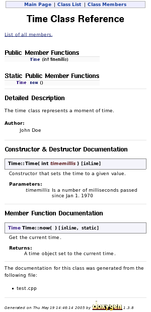

# Документация

Кирилл Корняков (Itseez, ННГУ)\
Апрель 2016

<!-- TODO
-->

# Содержание

  1. Внешняя документация
  1. Внутренняя документация

# Виды документации

  - Внешняя документация
    - Руководство пользователя
    - Маркетинговые материалы
    - Релизная документация (Release notes)
    - Уроки и примеры использования
  - Внутренняя документация
    - Техническое задание
    - Документация разработчика
    - Документация тестера

# Форматы внешних документов

  - Документы
    - Примеры: Руководство пользователя
    - Инструменты: Latex, Microsoft Word, Google Docs => PDF
  - Онлайн ресурсы
    - Примеры: Сайт-визитка, Новостная лента, Блог
    - Инструменты: CMS, Jekyll

# Распределение ролей при работе над документацией

  - Нужно отделять __содержание__ от __представления__.
  - Роль разработчиков
    - Несут основную нагрузку по созданию и поддержанию документации
      (как и в случае с тестированием!).
    - Следят за актуальностью и корректностью.
    - Автоматизируют генерацию документации и проверку актуальности.
  - Роль технических писателей в основном состоит в следующем:
    - Проверка и коррекция грамматики и орфографии.
    - Проверка и улучшение полноты и понятности.
    - Работа над визуальным представлением.

# Способы создания документации

> Единственная на 100% актуальная документация к вашей системе — это ее исходный
код.

  1. Вручную
     - Очень просто вначале, но крайне дорогая поддержка
  1. Автоматически: генерация на основе исходных кодов
     - Относительно дорогой старт, но дешевая поддержка
     - Примеры: API reference
     - Инструменты: Doxygen

# Doxygen

+--------------------------------------------------------+----------------------------+
|```cpp                                                  ||
|/**                                                     |                            |
| * @file                                                |                            |
| * @author  John Doe <jdoe@example.com>                 |                            |
| * @version 1.0                                         |                            |
| * @section DESCRIPTION                                 |                            |
| * The time class represents a moment of time.          |                            |
| */                                                     |                            |
|                                                        |                            |
|class Time {                                            |                            |
| public:                                                |                            |
|    /**                                                 |                            |
|     * Constructor that sets the time to a given value. |                            |
|     *                                                  |                            |
|     * @param timemillis Number of milliseconds         |                            |
|     *        passed since Jan 1, 1970.                 |                            |
|     */                                                 |                            |
|    Time (int timemillis);                              |                            |
|                                                        |                            |
|    /**                                                 |                            |
|     * Get the current time.                            |                            |
|     *                                                  |                            |
|     * @return A time object set to the current time.   |                            |
|     */                                                 |                            |
|    static Time now ();                                 |                            |
|};                                                      |                            |
|```                                                     |                            |
+--------------------------------------------------------+----------------------------+

# Автоматические проверки документации

  - Соответствие API reference актуальному API
  - Проверка корректности примеров кода (ссылка на тесты)
  - Проверка доступности гиперссылок
  - Проверка языковой грамматики

# Примеры внутренних документов

  - Документация разработчика
    - Инструкция по сборке и запуску
    - Стиль кодирования
    - Архитектура
    - High-level design (HLD)
    - Low-level design (LLD)
  - Документация тестера
    - Инструкция по сборке и запуску тестов
    - План ручного тестирования
  - Общепроектные документы
    - Процедура подготовки и выпуска релизов
    - Описание используемы

# Форматы внутренних документов

  - `README` файлы
  - Wiki для проекта
  - Rich-format документы

# Эволюция форматов документации разработчика

  - Технические писатели и бумажные документы
  - Rich-format документы (PDF, DOC) в VCS
  - На сегодняшний день популярны следующие подходы
    - Rich-format документы на Sharepoint
    - Документы в облаке с совместным редактированием (Google Docs)
    - Wiki
    - README (plain-text документы в репозитории)

# `README` файлы

  - Можно считать некой "точкой входа" в документацию
  - Расположен в корне репозитория с исходниками или дистрибутива
  - Документ в plain-text формате (TXT, Markdown, и т.д.)
  - Благодаря GitHub получил "второе дыхание",\
    как самый простой способ создать веб-страницу для проекта

# Типичное содержание `README` файла

  - Configuration instructions
  - Installation instructions
  - Operating instructions
  - A file manifest (list of files included)
  - Copyright and licensing information
  - Contact information for the distributor or programmer
  - Known bugs
  - Troubleshooting
  - Credits and acknowledgments
  - A changelog (usually for programmers)
  - A news section (usually for users)

[Wikipedia][wiki-readme]

# Эволюция `README` файлов

+---------------------+----------------------------------------------------+
| `README`            | General information                                |
| `AUTHORS`           | Credits                                            |
| `THANKS`            | Acknowledgments                                    |
| `CHANGELOG`         | A detailed changelog, intended for programmers     |
| `NEWS`              | A basic changelog, intended for users              |
| `INSTALL`           | Installation instructions                          |
| `COPYING / LICENSE` | Copyright and licensing information                |
| `BUGS`              | Known bugs and instructions on reporting new ones  |
+---------------------+----------------------------------------------------+

# Wiki для проекта

  - С распространением Internet документацию стало принято публиковать онлайн

# Преимущества wiki

  - Совместили в себе "легковесный" и "полновесный" подходы
  - Позволили иметь богатую документацию, при простоте работы с ней
  - Исходники представляют собой plain-text формат в некой легковесной разметке
  - На сегодняшний день чаще всего пишутся в Markdown формате и версионируются Git

# Ключевые моменты

  - Документация весьма дорога в поддержке/развитии. Причина этого в том, что
    нет компилятора, который проверял бы коррекность, и практически невозможно
    покрыть тестами.
  - Стоит создавать __необходимый минимум__ документации.
  - Если можно улучшить ПО таким образом, чтобы сделать документацию ненужной,
    стоит предпочесть это улучшение (аналогично комментариям).
  - Ответственность за корректность и полноту документации несут разработчики.
  - Следует максимально автоматизировать генерацию и валидацию документации.

# Контрольные вопросы

  - TBD

# Спасибо

Вопросы?

<!-- LINKS -->
