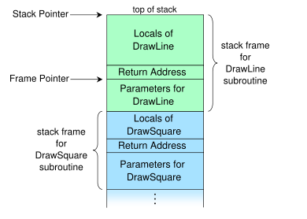

# Отладка с помощью GDB

<!--  -->
> “Не беспокойтесь, если что-то не функционирует правильно. Если бы все
> работало, вы были бы без работы.”
>
> Неизвестный

Никита Манович (Itseez)\
2013

<!-- TODO
  - Написвть резюме для этой лекции
-->

# Содержание

  1. Введение в отладку
  1. Демонстрация: Отладка однопоточного приложения Введение в GDB
  1. Демонстрация: Post-mortem отладка
  1. Демонстрация: Отладка многопоточного приложения
  1. Демонстрация: Удаленная отладка с помощью GDB
  1. Заключение

# Отладка и отладчик

  - **Отладка** - это процесс нахождения и устранения ошибок и дефектов в
    компьютерной программе или в электронном оборудовании.
  - **Отладчик** - это компьютерная программа, которая используется для
    тестирования и отладки других программ.

Примеры:

  - **GDB**: GNU отладчик
  - **Valgrind**: утилита для отладки проблем с памятью, утечек памяти и
    профилирования
  - **strace**: трассирование системных вызовов
  - **OProfile**: профилировщик для Linux систем

# Распространенные техники отладки

  - **Printf** отладка, **трассирование** и **логирование**
  - **Post-mortem** отладка (дамп памяти, логи)
  - Использование специальных программ (**отладчиков**)
  - Проверка различных утверждений в коде (**assert**)
  - Алгоритм **"волчья ограда"**

# Общие определения: breakpoint

**Breakpoint** (точка останова) - это преднамеренное прерывание выполнения
программы, при котором выполняется вызов отладчика.

Какие бывают точки останова?

  - Точка останова с поддержкой аппаратуры
  - Точка останова реализованная программно

**Примеры команд для GDB**: break, rbreak, tbreak

# Общие определения: watchpoint

**Watchpoint** - точка останова по данным. Срабатывает, когда меняется значение
заданного выражения или переменной.

**Примеры команд для GDB**: watch, rwatch, awatch

# Общие определения: checkpoint

**Checkpoint** - снимок состояния программы.

Плюсы:

  - Возможность начать отладку с определенной точки
  - Иногда можно откатить операции ввода/вывода
  - Можно обойти проблемы с рандомизацией адресного пространства в системах
    GNU Linux

Минусы:

  - Не подходит для многопоточной программы
  - Меняется идентификатор отлаживаемого процесса
  - Действия с вводом/выводом нельзя отменить полностью

# Общие определения: catchpoint

**Catchpoint** - специальная точка останова, которая срабатывает при достижении
специального события, например, C++ исключения или загрузки библиотеки.

**Примеры команд для GDB**: catch throw, catch catch, catch syscall, catch load.

# Общие определения: call stack

**Call stack (стек вызовов)** - хранит информацию об активных процедурах и
функциях.



# Приемы против отладки

  - Проверка, что отладчик запущен
  - Детектирование по времени выполнения кода
  - Определение модификации кода
  - С помощью исключений
  - Использование уязвимостей
  - Сломанный дизассемблер

# Краткая история проекта GDB

  - GDB был написан **Ричардом Столлманом в 1986** как часть его GNU системы
  - С 1990 по 1993 он поддерживался Джоном Гилмором пока он работал на Cygnus Solutions
  - Сейчас этот отладчик поддерживается управляющим комитетом GDB

Наиболее популярный GDB GUI - это **DDD**
Стабильный выпуск: 30 августа, 2013: **GDB 7.6.1**
Сайт: <http://www.gnu.org/software/gdb>

# Компиляция для отладки (GCC)

Полезные опции для GCC компилятора:

  - **`-g<level>`** - отладочная информация в нативном формате для операционной системы
     - level = 0 - нет отладочной информации
     - level = 1 - минимально необходимая информация
     - level = 3 - дополнительная информация
  - **`-ggdb<level>`** - информация в формате GDB
  - **`-O0`** - отключение всех оптимизаций компилятора
  - **`-fno-omit-frame-pointer`** - использовать указатель на фрейм

# Запуск программ из под GDB

  - **`$ gdb --args <программа с аргументами>`**
  - **`$ gdb <программа> [<pid>] [<core-файл>]`**
  - **`r, run [аргументы]`** - запуск программы под GDB
  - **`start [аргументы]`** - удобный способ запуска программы с точкой останова на первой строчке функции `main`
  - **`attach <pid> / detach`** - отладка уже запущенного процесса

# Продолжение и пошаговое исполнение

  - **`continue, c, fg`** - возобновление исполнения программы
  - **`s, step [count]`** - продолжить исполнение до следующей строчки исходного кода
  - **`n, next [count]`** - продолжить исполнение до следующей строчки исходного кода в текущем фрейме
  - **`ni, nexti, si, stepi [count]`** - так же как `next` и `step`, но для инструкции
  - **`fin, finish`** - продолжить исполнение до тех пор, пока текущая функция не завершится
  - **`u, until [location]`** - продолжить исполнение до тех пор, пока не достигнута следующая строчка

# Вывод информации о стеке вызовов

  - **`bt, backtrace [full] [n]`** - напечатать стек вызовов
  - **`frame [n]`** - навигация по текущему стеку вызовов
  - **`info frame`** - вывести подробную информацию о текущем стековом фрейме
  - **`info args`** - вывести аргументы для текущего фрейма
  - **`info locals`** - вывести локальные переменные для текущего фрейма

# Просмотр данных

  - **`print [/fmt] <expr>`** - показать значение выражения
     - a - указатель
     - x - шестнадцатеричное целое
     - s - трактовать как C-строку
     - u - беззнаковое целое
  - **`print *address@<len>`** - показать массив
  - **`display [/fmt] <expr>`** - показывать каждый раз
  - **`delete/disable/enable display <id>`** - управлять списком для отображения данных
  - **`info display`** - вывести список выражений для отображения
  - **`info <registers | all-registers>`** - показать регистры

# Навигация по исходным файлам

  - **`l, list [linenum | function | - | +]`** - показать код
  - **`forward-search, search regexp`** - искать в прямом направлении в текущем файле
  - **`reverse-search regexp`** - искать в обратном направлении в текущем файле
  - **`dir, directory <dirname>`** - добавить директории для поиска файлов
  - **`set substitute-path <to> <from>`** - определить подстановочное правило для директории
  - **`disassemble [/m | /r] [start,+length]`** - показать диапазон памяти, как инструкции процессора

# Исполнение в обратном направлении

  - **`record [full]`** - начать процесс записи
  - **`record stop`** - остановить процесс записи
  - **`reverse-continue, reverse-step, reverse-next, reverse-nexti,`**
    **`reverse-stepi, reverse-finish`** - команды для обратного исполнения программы
  - **`checkpoint`** - сделать снимок состояния программы
  - **`restart <checkpoint-id>`** - восстановить состояние
  - **`info checkpoints`** - информация о всех checkpoints
  - **`delete checkpoint <id>`** - удалить checkpoint

# Текстовый пользовательский интерфейс

  - Запустить `gdb -tui` и **C-x C-a** сочетание клавиш
  - В TUI режиме, gdb может отображать несколько окон:
     - command - GDB командная строка и вывод
     - source - показывает исходный код программы
     - assembly - показывает вывод дизассемблера
     - register - показывает регистры процессора
  - `layout <prev | next | asm | src | split | regs>`
  - `focus <prev | next | asm | src | split | regs | cmd>`
  - `refresh` (или **C-L** сочетание клавиш)

# Полезные трюки

  - Количество вызовов функции (break, ignore, info break)
  - Отладка макросов (CFLAGS/CXXFLAGS=-ggdb3)
  - Поиск исходных файлов (directory, substitute-path)
  - Python внутри gdb (python, gdb.*, end)
  - ~/.gdbinit (команды, запускающиеся на старте gdb)
  - save breakpoints <файл> / source <файл>
  - `commands <n>` установить команды для точек останова
  - Профилировщик (<http://poormansprofiler.org>)

# Post-mortem отладка использование GDB

```tbd
$ ulimit -a
core file size (blocks, -c) unlimited ...
$ ulimit -c unlimited
$ gdb <program> <core>
```

Полезные команды GDB:

**`gcore, generate-core-file <файл>`** - сгенерировать дамп памяти исследуемого процесса

# Резюме

  1. TBD

# Контрольные вопросы

  1. Что такое отладка и отладчик?
  1. Назовите 3 метода отладки и опишите их.
  1. Опишите алгоритм отладки "Волчья ограда" (wolf fence).
  1. Расшифруйте и объясните следующие термины: breakpoint, watchpoint,
     checkpoint, catchpoint и call stack.
  1. Перечислите 3 распространенных приема против отладки.
  1. Объясните назначение отладочной информации и как нужно скомпилировать
     программу, чтобы она была.
  1. Напишите 5 команд отладчика GDB (запуск, поставить точку останова с
     условием, продолжить, распечатать локальные переменные, завершить работу
     отладчика).

# Ссылки на литературу:

  - [Debugging with GDB](https://sourceware.org/gdb/onlinedocs/gdb/)
  - [RMS’s gdb debugger tutorial](http://www.unknownroad.com/rtfm/gdbtut/)
  - [Using the GNU GDB debugger](http://rsquared.sdf.org/gdb/)
  - [How debuggers work?](eli.thegreenplace.net/programs-and-code/how-debuggers-work/)
  - [Debugging tools and techniques for Linux](http://www.ibm.com/developerworks/systems/library/es-debug/)
  - [Introduction to the DWARF debugging format](http://dwarfstd.org/doc/Debugging%20using%20DWARF-2012.pdf)
  - [Beginners Guide to Basic Linux Anti Anti Debugging Technique](http://www.stonedcoder.org/~kd/lib/14-61-1-PB.pdf)
  - [Poor man’s profiler](http://poormansprofiler.org/)

# Спасибо!

Вопросы?
