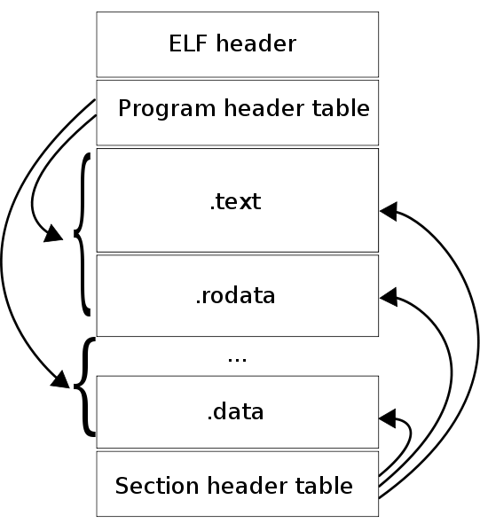

# Анализ бинарных модулей

<!--  -->

Александр Сморкалов (Intel, ННГУ)
Март 2018

# Содержание

  1. Мотивация
  1. Исполняемые модули и их форматы
  1. Основные секции исполняемых модулей
  1. Компиляция, статическая и динамическая компоновка
  1. API, бинарная совместимость
  1. Особенности компиляции C/C++
  1. Анализ зависимостей
  1. Статический анализ
  1. Динамический анализ

# Мотивация. Зачем мне анализ бинарных модулей?

  1. Проектирование операционных систем и системное программирование;
  1. Правильное проектирование прикладного ПО;
  1. Информационная безопастность;
  1. Устранение проблем во время разработки;
  1. Поддержка библиотек и SDK.

# Исполняемые модули

> __Исполняемый модуль__ — файл, содержащий программу в виде, в котором
она может быть (после загрузки в память и настройки по месту) исполнена
вычислительной машиной.

  1. Аппаратная машина;
  1. Программная машина.

# Аппаратная ВМ

  1. Программа представлена в виде двоичного кода для процессора с конкретной архитектурой;
  1. Программа выполняется на "железном" процессоре;
  1. Исполняемый модуль зависит от ОС и архитектуры ВМ;
  1. Примеры: CPU, GPU, DSP, etc.

# Программная ВМ

  1. Программа может быть представлена в произвольном виде;
  1. Программа выполняется внутри абстрактной виртуальной машины;
  1. Выполняемый модуль не привязан к архитектуре аппаратной машины;
  1. Модуль использует свою модель выполнения, м.б. отличной от аппаратной;
  1. Примеры: JVM, Dalvik, .NET.

# Компиляция

> __Компиляция__ — трансляция программы, составленной на исходном языке высокого
> уровня, в эквивалентную программу на низкоуровневом языке, близком машинному
> коду.

В настоящий момент применяется раздельная компиляция:

  1. Компиляция отдельных единиц языка высокого уровня
  2. Компоновка (связывание)

# Компиляция единиц ЯВУ

  1. Вход: один или несколько файлов с программой на ЯВУ;
  1. Выход:
     - объектный файл;
     - отладочная информация.

# Объектный файл

  1. Объектный файл  содержит представление в виде команд для целевой ВМ,
     но не готов для исполнения.
  1. Формат объектного файла задаётся компилятором;
  1. Все импортируемые и экспортируемые символы сведены в таблицу;
  1. Все вызовы функций и методов, обращения к внешним переменным и константам
     замещены ссылками на таблицу;
  1. Вызов функций и методов производится в соответствующими соглашениями
     (fastcall, thiscall, stdcall, cdecl).

# Компоновка (связывание)

  1. Вход: объектные файлы, статические и динамические библиотеки;
  1. Выход:
     - статическая библиотека или динамическая библиотека или исполняемая
       программа
     - отладочная информация.

# Статическая компоновка (связывание)

  1. Компоновка исполняемого модуля на этапе компиляции;
  1. Все функции находятся внутри выполняемого модуля;
  1. Все адреса переменных и функций определяются на этапе компиляции;
  1. "Нет зависимости" от других библиотек.

# Динамическая компоновка (связывание)

  1. Компоновка исполняемого модуля во время исполнения;
  1. Библиотечные функции находятся в других модулях;
  1. Связывание происходит во время выполнения путём заполнения таблиц адресов;
  1. Явная зависимость от других библиотек.

# Статическая библиотека

  - Windows `*.lib`
  - Unix: `*.a`

  1. Коллекция функций, методов, переменных, констант;
  1. Предназначена только для статической компоновки;
  1. Элементы статической библиотеки могут быть не скомпонованы меду собой;
  1. Аналогично объектному файлу может содержать таблицу импорта и экспорта.

# Динамическая библиотека

  - Windows `*.dll`
  - Unix: `*.so, *.dynlib`

  1. Коллекция функций, методов, переменных, констант;
  1. Предназначена для статической и динамической компоновки;
  1. Элементы статической библиотеки скомпонованы меду собой;
  1. Аналогично объектному файлу содержит таблицу импорта и экспорта.

# Форматы исполняемых модулей

Формат определяет структуру модуля на диске и в памяти, а также правила его загрузки

  1. Примитивные, не переносимые:
     - являются дампом памяти и, как правило, отражают детали аппаратуры;
     - пример: прошивки микроконтроллеров, ранние BIOS, COM файлы для CP/M и DOS.
  1. Переносимые:
     - предназначены для стандартизированной среды исполнения
     - могут содержвть не только программу, но и статичные ресурсы
     - пример: NE, PE для OS Windows, COFF, ELF для Unix*

# COM модуль (CP/M и MS-DOS)

  1. Нет заголовков и метаданных;
  1. Нет явных зависимостей;
  1. Загружается всегда по одному и тому же адресу относительно сегмента;
  1. Файл == сегмент в терминах CPU и RAM;
  1. Максимальный размер 64 KiB;

# ELF модуль (Unix) 1

  1. Заголовок файла:
    - Архитектура аппаратной платформы;
    - Аппаратно зависимые флаги;
    - Точка входа
  1. Таблица заголовков сегментов;
  1. Таблица заголовков секций;
  1. Данные сегментов и секций.

# ELF модуль (Unix) 2

# ELF модуль (Unix) 3

__Сегмент__ - это непрерывная область адресного пространства со своими атрибутами доступа.
В частности, сегмент кода имеет атрибут исполнения, а сегмент данных - атрибуты чтения и записи.
__Секция__ - фрагмент сегмента, имеющий определённое назначение:
  - .init (процедуры инициализации);
  - .plt (секция связок);
  - .text (основой код программы);
  - .fini (процедуры финализации).

Информация о сегментах используется при выполнении (Run-time).
Информация о секциях используются при компоновке (Link-time).
Исполняемые файлы, `*.so`, `*.a`, `*.o` файлы используют ELF формат.

# PE Модуль (Windows) 1

PE == Portable Executable

 1. MS DOS часть для совместимости;
 1. PE заголовок
     - Архитектура аппаратной платформы;
     - Аппаратно зависимые флаги;
     - Подсистема Windows (GUI, CUI, OS/2, Posix);
     - Точка входа;
     - Контрольная сумма;
 1. Заголовки секций;
 1. Данные секций.

# PE Модуль (Windows) 2

# PE Модуль (Windows) 3

 - Исполняемые файлы *.exe, динамические библиотеки *.dll и драйверы используют PE формат;
 - Формат несколько раз расширялся и некоторые функции могут быть реализованы по-разному;
 - Не все инструменты одинаково интерпретируют/генерируют PE файлы;
 - В PE  модуле есть отдельная секция ресурсов.
 - Хорошая статья на Хабре с деталями: http://habrahabr.ru/post/266831/

# API & ABI

__API__ (Application Programming Interface) — набор готовых классов, процедур, функций, структур и констант,
предоставляемых ОС, приложением, библиотекой для использования во внешних программных продуктах.

__Совместимость на уровне API__ — совместимость на уровне исходного кода на языке программирования.
Замена библиотеки на другую не ломает компиляцию и логику программы.

__ABI__ (Application Binary Inerface) — бинарный интерфейс программ и библиотек, включающий в себя соглашения
о вызовах, передаче параметров, обработке исключений и других сущностей языков программирования.

__Бинарная совместимость__ — совместимость на уровне скомпилированных модулей.
Модуль можно заменить другим без потерь.

  1. Все современные ОС предоставляют API;
  1. Все прикладные приложения явно или косвенно от него зависят;
  1. Необходимо поддерживать совместимость.

# Способы реализации API & ABI

  1. Программные прерывания процессора;
  1. Динамическая компоновка и вызов библиотечных функции;
  1. Формирование пакетов данных соответствующих общим соглашениям, протоколы.

# Общие вопросы бинарной совместимости

  1. Соглашения о базовых структурах данных:
     - Числа с плавающей точкой;
     - Порядок байт (Big Endian, Litle Endian);
  1. Соглашения о вызовах функций:
     - Fat Call, This Call, CDECL;
     - Soft Float, Hard Float.
  1. Соглашения о наименовании идентификаторов и их совместимости с языками программирования.
  1. Соглашения о общих разделяемых библиотеках и их версиях;
  1. Соглашения об управлении ресурсами;
  1. Управление версиями компиляторов и инструментов разработки:
     - GCC меняет соглашение о ABI при смене мажорной версии.

# Особенности языков программирования

  1. Перегрузка функций и методов требует декорирования имён для получения уникальных идентификаторов;
  1. Инлайн методы и шаблонные классы не экспортируются;
  1. В программах могут быть неявные сущности, например, VTBL, RTTI в С++;
  1. Среда выполнения может управлять программой во время выполнения кода (Run-Time).

# Управление ресурсами

 1. MS Visual Studio предоставляет несколько версий стандартных библиотек С и C++.
    Они не совместимы между собой, в том числе в рамках одной версии;
 1. Каждый экземпляр страндартной библиотеки C или C++ имеет свой менеджер памяти.
    Выделение и освобождение памяти должно происходить в контексте одного менеджера памяти;
 1. OpenCL, CUDA, OpenGL, OpenVX, DirectX ресурсы связяны с конкретным менеджером ресурсов
    и необходимо соблюдать их правила.

# Бинарная совместимость на примере С++

  1. Совпадают сигнатуры всех функций и методов;
  1. Совпадает sizeof для всех экспортируемых объектов;
  1. Совпадает состав всех структур, в том числе выравнивание;
  1. Совпадают значения параметров по умолчанию;
  1. Совпадают виртуальные методы, не добавляется новых виртуальных методов;
  1. Совпадает иерархия виртуального наследования;
  1. Могут отличаться имена констант, если они не экспортируются из библиотеки как символ;
  1. Могут отличаться имена и структура макросов;
  1. Могут быть добавлены новые невиртуальные методы;
  1. Могут быть добавлены перегрузки функций, если функция уже была перегружена;
  1. etc

# Бинарная совместимость (2)

  - Подход проекта KDE: <http://techbase.kde.org/Policies/Binary_Compatibility_Issues_With_C++>
  - Инструмент проверки совместимости: `abi-compliance-checker`

# Совместимость на уровне исходного кода на примере С++

  1. Может отличаться число параметров функции, если определены значения по
     умолчанию для новых параметров;
  1. Могут быть добавлены перегрузки методов;
  1. Могут отличаться виртуальные методы;
  1. Могут отличаться sizeof, выравнивание и поля структур;
  1. Совпадают имена всех констант и макросов;
  1. etc

# Статический анализ

Анализ без запуска модуля на выполнение

  1. Анализ таблиц импорта и экспорта
  1. Распаковка статических данных (ресурсов)
  1. Дизассемблирование

# Linux

  1. readelf, ar, c++filt
  1. objdump, gdb, nm

# Windows

  1. Dependency Walker
  1. Olly DBG, IDA Pro, HEIW, etc

# Динамический анализ

  1. Отладка
  1. Профилировка производительности
  1. Профилировка системных вызовов
  1. Профилировка работы с памятью
  1. etc

# Linux

  1. gdb
  1. gprof, oprofile
  1. strace, ltrace
  1. valgrind

# Windows

  1. MS WinDBG, Olly DBG, VisualStudio
  1. Intel: VTune, Parallel Studio, etc
  1. Sysinternals tools: Filemon, Regmon, DebugView

# Инструменты

  1. Dependency Walker: <http://www.dependencywalker.com/>
  1. Filemon: <http://technet.microsoft.com/en-us/sysinternals/bb896642.aspx>
  1. Regmon: <http://technet.microsoft.com/en-us/sysinternals/bb896652.aspx>
  1. DebugView: <http://technet.microsoft.com/en-us/sysinternals/bb896647.aspx>
  1. abi-compliance-checker: <http://ispras.linuxbase.org/index.php/ABI_compliance_checker>
  1. Olly DGB: <http://www.ollydbg.de/>
  1. abi-compliance-checker <http://ispras.linuxbase.org/index.php/ABI_compliance_checker>
  1. valgrind: <http://valgrind.org/>

# Контрольные вопросы

  1. Определение: Исполняемый модуль
  1. Определение: API
  1. Зачем нужно разделение на сегменты и секции в исполняемых модулях?
  1. Что такое статическое и динамическое связывание, в чём их отличия?
  1. Что такое бинарная совместимость и совместимость на уровне исходного кода?

# Спасибо за внимание!

Вопросы?
